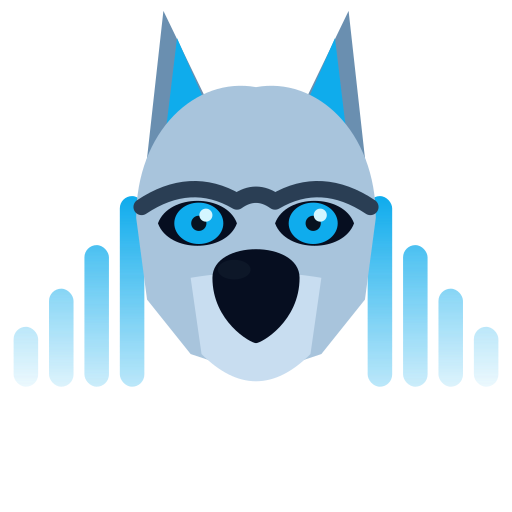

<p align="center">
  
</p>

<h1 align="center">WolfWave - Your Music, Everywhere</h1>

<p align="center">
  A native macOS menu bar app that shares what you're listening to on Apple Music with your Twitch chat, Discord profile, and stream overlays — automatically.
</p>

<p align="center">
  <a href="https://github.com/MrDemonWolf/WolfWave/releases">Download</a> &bull;
  <a href="https://mrdemonwolf.github.io/wolfwave">Docs</a> &bull;
  <a href="CHANGELOG.md">Changelog</a> &bull;
  <a href="https://mrdwolf.net/discord">Discord</a>
</p>

## Features

- **Now Playing in Twitch Chat** — Viewers type `!song` and instantly see what you're listening to
- **Discord Rich Presence** — Show "Listening to Apple Music" on your profile with album art
- **OBS Stream Widget** — Drop-in browser source overlay that displays your current track
- **Automatic Updates** — Stay up to date via Sparkle (DMG) or Homebrew (`brew upgrade --cask`)
- **Secure by Default** — Credentials stored in macOS Keychain, never plain text
- **Easy Setup** — Guided onboarding wizard gets you connected in minutes

## Getting Started

### Homebrew (recommended)

```bash
brew tap mrdemonwolf/den
brew install --cask wolfwave
```

### Manual Download

1. Grab the latest `.dmg` from [GitHub Releases](https://github.com/MrDemonWolf/WolfWave/releases)
2. Open the DMG and drag **WolfWave** to **Applications**
3. Launch WolfWave and follow the onboarding wizard

> The app is signed and notarized by Apple — no Gatekeeper warnings.

## Usage

### Chat Commands

Your viewers can use these commands in Twitch chat:

| Command                                | What it does             |
| -------------------------------------- | ------------------------ |
| `!song` · `!currentsong` · `!nowplaying` | Shows the current track  |
| `!lastsong` · `!last` · `!prevsong`      | Shows the previous track |

### Discord Rich Presence

Enable in **Settings > Discord Integration** to show what you're listening to on your Discord profile. Album artwork is fetched automatically — no manual setup needed.

### OBS Stream Widget

Enable in **Settings > Stream Widgets** to start a local WebSocket server that powers a browser source overlay. Copy the widget URL and add it as a Browser Source (500 x 120) in OBS to display your now-playing track on stream.

## Development

### Prerequisites

- macOS 15.0+
- Xcode 16.0+
- Swift 5.9+
- [bun](https://bun.sh) (for docs, marketing, and monorepo scripts)
- Command Line Tools: `xcode-select --install`

### Setup

```bash
git clone https://github.com/MrDemonWolf/WolfWave.git
cd WolfWave

# Configure API keys
cp apps/native/wolfwave/Config.xcconfig.example apps/native/wolfwave/Config.xcconfig
# Edit Config.xcconfig with your Twitch Client ID and Discord Application ID

# Open in Xcode and run (Cmd+R)
make open-xcode
```

> Get a Twitch Client ID at [dev.twitch.tv/console/apps](https://dev.twitch.tv/console/apps)
>
> Get a Discord Application ID at [discord.com/developers/applications](https://discord.com/developers/applications)

### Docs Site (Local)

```bash
bun install && bun run dev --filter docs
```

Open **http://localhost:3000/widget/?port=8765** to preview the OBS stream widget locally.

### Development Scripts

#### Monorepo (bun + Turborepo)

| Command                                    | Description              |
| ------------------------------------------ | ------------------------ |
| `bun install`                              | Install all workspace dependencies |
| `bun run dev --filter docs`                | Start docs dev server    |
| `bun run build --filter docs`              | Build docs site          |
| `bun run dev --filter wolfwave-announcement` | Open Remotion studio   |

#### Native App (Make)

| Command            | Description                              |
| ------------------ | ---------------------------------------- |
| `make build`       | Debug build                              |
| `make clean`       | Clean build artifacts                    |
| `make prod-build`  | Release build + DMG                      |
| `make notarize`    | Notarize the DMG (requires Developer ID) |
| `make test`        | Run unit tests (210 tests)               |
| `make open-xcode`  | Open Xcode project                       |
| `make update-deps` | Resolve SwiftPM dependencies             |


## Testing

Run the full test suite with:

```bash
make test
```

Or in Xcode with **Cmd+U**. Tests cover bot commands, version comparison, onboarding navigation, Twitch view model state, and app constants integrity. The CI pipeline runs tests automatically on every push and pull request to `main`.

## Documentation

Full docs at **[mrdemonwolf.github.io/wolfwave](https://mrdemonwolf.github.io/wolfwave)**

- [Installation](https://mrdemonwolf.github.io/wolfwave/docs/installation)
- [Usage Guide](https://mrdemonwolf.github.io/wolfwave/docs/usage)
- [Bot Commands](https://mrdemonwolf.github.io/wolfwave/docs/bot-commands)
- [Features](https://mrdemonwolf.github.io/wolfwave/docs/features)
- [Privacy Policy](https://mrdemonwolf.github.io/wolfwave/docs/privacy-policy)

## Contributing

Want to contribute? Check out the [Development Guide](https://mrdemonwolf.github.io/wolfwave/docs/development) for build instructions, architecture overview, and testing info.

## License


## Support

Questions or feedback? Join the Discord: [mrdwolf.net/discord](https://mrdwolf.net/discord)

---

Made with ❤️ by [MrDemonWolf, Inc.](https://www.mrdemonwolf.com)
