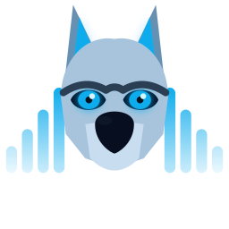

<div align="center">
  
</div>

# WolfWave - Your Music, Everywhere on Stream

Stop telling chat what song is playing. WolfWave is a tiny native
macOS menu bar app that bridges Apple Music with Twitch chat, Discord
Rich Presence, and OBS stream overlays. Play something in Apple Music
and your Twitch chat, Discord profile, and stream overlay all update on
their own.

Free, open source, signed and notarized by Apple. Built for streamers
and creators on macOS.

Your music plays. Everything else keeps up.

## Table of Contents

- [Features](#features)
  - [Twitch](#twitch)
  - [Discord](#discord)
  - [Stream Overlays](#stream-overlays)
  - [History & Stats](#history--stats)
  - [Platform & Security](#platform--security)
- [Getting Started](#getting-started)
  - [DMG Installer](#dmg-installer-recommended)
  - [Homebrew](#homebrew-for-developers)
- [Usage](#usage)
  - [Viewer Commands](#viewer-commands)
  - [Mod and Broadcaster Commands](#mod-and-broadcaster-commands)
  - [Discord Rich Presence](#discord-rich-presence)
  - [Stream Widgets](#stream-widgets)
- [Tech Stack](#tech-stack)
- [Development](#development)
  - [Prerequisites](#prerequisites)
  - [Setup](#setup)
  - [Development Scripts](#development-scripts)
  - [Code Quality](#code-quality)
- [Project Structure](#project-structure)
- [License](#license)
- [Contact](#contact)

## Features

### Twitch

- **Now Playing in Chat.** Viewers type `!song`, `!currentsong`, or `!nowplaying` and instantly see the track you're spinning.
- **Song Requests.** Viewers request songs with `!sr <track>`. Requests play through Apple Music without stealing focus from OBS.
- **Channel Points & Bits.** A WolfWave-managed "Request a Song" channel-point reward, plus bit cheers that boost the cheerer's queued track to the front.
- **Chat Vote-Skip.** Viewers vote off a song with `!voteskip` or `!vs`, in chat-tally mode or native Twitch Polls.
- **Hold-Mode Queue.** Mods hold, resume, skip, and clear the request queue from chat or the menu bar.
- **Live Queue View.** See what's playing, what's next, and who requested each track right inside the app.
- **Fallback Playlist.** Configure an Apple Music playlist that takes over when the queue runs dry.

### Discord

- **Discord Rich Presence.** Shows "Listening to WolfWave" on your Discord profile with Apple Music album art, the active playlist, and clickable open-in-Apple-Music and song.link buttons.

### Stream Overlays

- **Stream Widgets.** Drop-in browser-source overlay powered by a local WebSocket server with a per-install auth token, six themes (`Default`, `Dark`, `Light`, `Glass`, `Neon`, `WolfWave`), and three layouts (`Horizontal`, `Vertical`, `Compact`). Two-PC streamers can connect from a second machine on the LAN.

### History & Stats

- **Listening History & Stats.** Opt-in, on-device log of what you actually play: top artists, listening time, 7-day trend, and a listening-by-hour chart built on SwiftUI Charts.
- **Monthly Wrap.** A personal "wrapped"-style summary for any month, exportable as a shareable PNG.
- **`!stats` in Chat.** Viewers ask for today's top track. Replies only while you're live.

### Platform & Security

- **macOS 26 Liquid Glass Design.** Refreshed onboarding, settings, and menu bar built for Tahoe.
- **Light, Dark, or System.** Pick an appearance in Settings > General. System follows macOS; Light and Dark override it for the whole app, menu bar included.
- **Streamer Mode.** One-tap tray toggle that masks your Twitch channel name, widget URLs, and auth token across the UI, so the app is safe to show on camera.
- **Backup & Restore.** Export your settings to a portable JSON file from Settings > Advanced and bring them back on another Mac or after a reinstall. Accounts and secrets stay in the Keychain, never in the file.
- **Song-Change Notifications.** Opt-in macOS banner on every track change, with album art. The banner replaces in place instead of stacking.
- **Secure by Default.** Credentials live in the macOS Keychain, never plain text.
- **Automatic Updates.** Sparkle for DMG installs, or Homebrew (`brew upgrade --cask`).
- **On-Device Diagnostics.** Opt-in MetricKit diagnostics card with a share helper for attaching reports to a bug filing. Reports stay on-device.
- **Bug Report Flow.** One-click log export and a pre-filled GitHub issue from Advanced settings.

## Getting Started

Full docs at [mrdemonwolf.github.io/wolfwave](https://mrdemonwolf.github.io/wolfwave).

### DMG Installer (recommended)

1. Grab the latest `.dmg` from [GitHub Releases](https://github.com/MrDemonWolf/WolfWave/releases).
2. Open the DMG and drag **WolfWave** to **Applications**.
3. Launch WolfWave and follow the onboarding wizard.

### Homebrew (for developers)

```bash
brew tap mrdemonwolf/den
brew install --cask wolfwave
```

The app is signed and notarized by Apple, so there are no Gatekeeper
warnings.

## Usage

### Viewer Commands

| Command | What it does |
| --- | --- |
| `!song` `!currentsong` `!nowplaying` | Shows the current track |
| `!lastsong` `!last` `!prevsong` | Shows the previous track |
| `!sr <song>` | Requests a song for the queue |
| `!queue` | Shows the full request queue |
| `!myqueue` | Shows just your own requests |
| `!playlist` | Links the song request playlist |
| `!voteskip` `!vs` | Casts a vote to skip the current song |
| `!stats` | Shows today's top track (live only) |
| `!wolfwave` | Tells chat what WolfWave is (off by default, four reply styles) |

### Mod and Broadcaster Commands

| Command | What it does |
| --- | --- |
| `!skip` `!next` | Skips the current request |
| `!hold` | Pauses the queue so you can curate before releasing |
| `!resume` `!unhold` | Resumes a held queue |
| `!clearqueue` | Wipes the queue (with in-app confirmation) |

### Discord Rich Presence

Enable in **Settings > Discord** to show what you're listening to on
your Discord profile. Album artwork is fetched automatically.

### Stream Widgets

Enable in **Settings > Stream Widgets** to start a local WebSocket
server. Copy the widget URL (auth token auto-injected) and add it as a
Browser Source (500 x 120) in OBS. Two-PC streamers can reach the
overlay from a second computer or phone on the same network. Regenerate
the token from Settings to drop every active client.

## Tech Stack

| Layer | Technology |
| --- | --- |
| Language | Swift 5.9+ |
| UI | SwiftUI, AppKit |
| Platform | macOS 26.0+ (Tahoe), Apple Silicon, Apple Music app required |
| Music | ScriptingBridge, MusicKit, AppleScript |
| Twitch | EventSub WebSocket, Helix API |
| Discord | Rich Presence via local IPC Unix domain socket |
| Networking | URLSession, Network framework, NWListener (WebSocket overlay) |
| Updates | Sparkle (EdDSA-signed appcast) |
| Charts | SwiftUI Charts (History & Stats) |
| Diagnostics | MetricKit (opt-in) |
| Security | macOS Keychain (Security framework) |
| Docs | Fumadocs (Next.js), bun, Turborepo |
| Marketing | Remotion |

## Development

### Prerequisites

- macOS 26.0+ (Tahoe)
- Apple Silicon (M1 or later)
- Xcode 16.0+
- Swift 5.9+
- [bun](https://bun.sh) for docs and marketing workspaces
- Command Line Tools: `xcode-select --install`

### Setup

1. Clone the repo:

```bash
git clone https://github.com/MrDemonWolf/WolfWave.git
cd WolfWave
```

2. Copy the config template:

```bash
cp apps/native/WolfWave/Config.xcconfig.example apps/native/WolfWave/Config.xcconfig
```

3. Edit `Config.xcconfig` with your Twitch Client ID and Discord
   Application ID. Get a Twitch Client ID at
   [dev.twitch.tv/console/apps](https://dev.twitch.tv/console/apps) and
   a Discord Application ID at
   [discord.com/developers/applications](https://discord.com/developers/applications).

4. Open the project:

```bash
make open-xcode
```

Then build and run with `Cmd+R` in Xcode.

### Development Scripts

Monorepo (bun + Turborepo):

- `bun install` installs all workspace dependencies.
- `bun dev` starts every dev server via Turbo.
- `bun run dev --filter docs` starts the docs dev server only.
- `bun run build --filter docs` builds the docs site.
- `bun run dev --filter wolfwave-announcement` opens Remotion studio for the launch announcement video.

Native app (Make):

- `make build` runs a debug build via `xcodebuild`.
- `make clean` cleans build artifacts.
- `make test` runs the unit test suite (run `make test` for the current pass count).
- `make update-deps` resolves SwiftPM dependencies.
- `make open-xcode` opens the Xcode project.
- `make ci` runs a CI-friendly build.
- `make prod-build` builds a release DMG in `builds/`.
- `make prod-install` builds a release and installs to `/Applications`.
- `make notarize` notarizes the DMG (requires Developer ID and env vars).
- `make widget` rebuilds the OBS overlay widget (`apps/widget/` to `Resources/widget.html`); required after editing `apps/widget/` sources.

### Code Quality

- Swift 5.9+ with async/await concurrency (no `DispatchQueue` for new async work).
- MVVM with `@Observable` view models.
- MARK sections in every file; DocC-style `///` comments on all public APIs.
- No force unwrapping. Optionals and `guard` only.
- Credentials always via `KeychainService`, never `UserDefaults`.
- Thread-safe service layer (NSLock, serial dispatch queues, MainActor isolation).
- Unit tests auto-discovered via Xcode synchronized groups under `apps/native/WolfWaveTests/`.

## Project Structure

```text
wolfwave/
├── apps/
│   ├── native/                 # Native macOS app (Swift, SwiftUI, AppKit)
│   │   ├── WolfWave/           # App source
│   │   ├── WolfWaveTests/      # Unit tests
│   │   └── WolfWave.xcodeproj  # Xcode project
│   ├── docs/                   # Fumadocs documentation site
│   ├── marketing/              # Remotion-based promo videos
│   └── widget/                 # OBS overlay widget source (builds Resources/widget.html)
├── assets/                     # Brand assets, logos
├── design-system/              # Design tokens + component catalog
├── CHANGELOG.md                # Release history
├── Makefile                    # Build, test, release targets
├── package.json                # bun workspaces root
└── turbo.json                  # Turborepo pipeline config
```

## License

[](https://github.com/MrDemonWolf/WolfWave/blob/main/LICENSE)

WolfWave is released under the GNU General Public License v3.0 (GPL-3.0).

## Contact

Questions or feedback?

- Discord: [Join my server](https://mrdwolf.net/discord)
- Issues: [GitHub Issues](https://github.com/MrDemonWolf/WolfWave/issues)
- Docs: [mrdemonwolf.github.io/wolfwave](https://mrdemonwolf.github.io/wolfwave)

---

Made with love by [MrDemonWolf, Inc.](https://www.mrdemonwolf.com)
