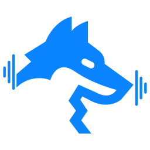

<div align="center">
  
</div>

# WolfWave - Your Music, Everywhere on Stream

Stop telling chat what song is playing. WolfWave is a tiny native
macOS menu bar app that bridges Apple Music with Twitch chat, Discord
Rich Presence, and OBS stream overlays. Play something in Apple Music
and your Twitch chat, Discord profile, and stream overlay all update on
their own.

Free, open source, signed and notarized by Apple. Built for streamers
and creators on macOS.

Your music plays. Everything else keeps up.

## Table of Contents

- [Features](#features)
  - [Twitch](#twitch)
  - [Discord](#discord)
  - [Stream Overlays](#stream-overlays)
  - [History & Stats](#history--stats)
  - [Platform & Security](#platform--security)
- [Getting Started](#getting-started)
  - [DMG Installer](#dmg-installer-recommended)
  - [Homebrew](#homebrew-for-developers)
- [Usage](#usage)
  - [Viewer Commands](#viewer-commands)
  - [Mod and Broadcaster Commands](#mod-and-broadcaster-commands)
  - [Discord Rich Presence](#discord-rich-presence)
  - [Stream Widgets](#stream-widgets)
- [Tech Stack](#tech-stack)
- [Development](#development)
  - [Prerequisites](#prerequisites)
  - [Setup](#setup)
  - [Development Scripts](#development-scripts)
  - [Code Quality](#code-quality)
- [Project Structure](#project-structure)
- [License](#license)
- [Contact](#contact)

## Features

### Twitch

- **Now Playing in Chat.** Viewers type `!song`, `!currentsong`, or `!nowplaying` and instantly see the track you're spinning.
- **Song Requests.** Viewers request songs with `!sr <track>`. Requests play through Apple Music without stealing focus from OBS.
- **Channel Points & Bits.** A WolfWave-managed "Request a Song" channel-point reward, plus bit cheers that boost a queued track to the front. Paid point and qualifying Bits actions use a local recovery record; WolfWave pauses the managed reward and shows a warning if durable recovery is unavailable.
- **Chat Vote-Skip.** Viewers vote off a song with `!voteskip` or `!vs`, in chat-tally mode or native Twitch Polls.
- **Hold-Mode Queue.** Mods hold, resume, skip, and clear the request queue from chat or the menu bar.
- **Live Queue View.** See what's playing, what's next, and who requested each track right inside the app.
- **Fallback Playlist.** Configure an Apple Music playlist that takes over when the queue runs dry.
- **Approve Before Play.** Opt-in "Require My Approval" holds every request (chat, channel points, bits) in the queue until you approve or decline it.
- **Fair-Share Ordering.** Round-robin queue plays everyone's first request before anyone's second, so a fast re-typist can't hog it. On by default; toggle off for classic FIFO.
- **Sub / VIP Priority.** Optional perk for subs, VIPs, and mods: skip the request cooldown, or jump ahead within the fair-share round. Off by default.
- **Blocklist.** Ban a song, a whole artist, or a person from requests. Blocked entries are rejected before they ever reach the queue.
- **Custom Commands.** Build your own chat commands with a fixed reply after connecting Twitch. Variables (`$user`, `$touser`, `$args`, `$1`–`$9`, `$song`, `$lastsong`), per-command aliases and cooldowns, a permission level (Everyone, Subscribers, VIPs, Moderators, or Broadcaster), and a delivery mode per command: reply to the chatter, plain chat message, or a Twitch announcement.

### Discord

- **Discord Rich Presence.** Shows "Listening to WolfWave" on your Discord profile with Apple Music album art, the active playlist, and clickable open-in-Apple-Music and song.link buttons.

### Stream Overlays

- **Stream Widgets.** Drop-in browser-source overlay powered by a local WebSocket server with a per-install read-only overlay token, five themes (`Default`, `Dark`, `Light`, `Glass`, `Neon`), and five layouts (`Horizontal`, `Vertical`, `Compact`, `Vinyl`, `Classic`). Two-PC streamers can receive now-playing data from a second machine on the LAN.
- **Queue Ticker Overlay.** Opt-in `?queueTicker=1` panel showing the next 3 song requests, title and requester, so viewers see their spot in line without asking chat.
- **OBS-friendly by design.** Visual progress is batched at 10 Hz, rendering sleeps while hidden or unloaded, and reduced-motion mode removes continuous animation work.
- **Settings deep links.** `wolfwave://settings/twitch/custom-commands` opens Settings on the Twitch pane, scrolls to Custom Commands, and flashes it. Every pane and card has a stable name, listed in the [Settings docs](https://mrdemonwolf.github.io/wolfwave/docs/settings#deep-links).
- **Stream Deck Control.** A separate control token authorizes play/pause, skip, request-queue, announce, block, and overlay-toggle commands (control protocol v3, twelve keys) only from this Mac; the read-only overlay token can never run them. The Elgato plugin lives at `apps/streamdeck/`, and its protocol is documented in [Stream Deck Control API](apps/native/docs/streamdeck-control-api.md).

### History & Stats

- **Listening History & Stats.** Opt-in, on-device log of what you actually play: top artists, listening time, 7-day trend, and a listening-by-hour chart built on SwiftUI Charts.
- **Monthly Wrap.** A personal "wrapped"-style summary for any month, exportable as a shareable PNG.
- **`!stats` in Chat.** Viewers ask for today's top track. Replies only while you're live.

### Platform & Security

- **macOS 26 Liquid Glass Design.** Refreshed onboarding, settings, and menu bar built for Tahoe.
- **Light, Dark, or System.** Pick an appearance in Settings > General. System follows macOS; Light and Dark override it for the whole app, menu bar included.
- **App Visibility.** Run menu-bar only, Dock only, or both, and set launch-at-login, from Settings > General. The menu bar icon stays reachable in every mode.
- **Guided Apple Music Access.** Onboarding requests the Automation permission for Music.app and shows a recovery screen with the exact fix if macOS denies it later.
- **Streamer Mode.** One-tap tray toggle that masks your Twitch channel name, widget URLs, and overlay/control tokens across the UI, so the app is safe to show on camera.
- **Backup & Restore.** Export your settings to a portable JSON file from Settings > Advanced and bring them back on another Mac or after a reinstall. Credentials and private account IDs stay in Keychain; the public Twitch channel name travels with your preferences.
- **Song-Change Notifications.** Opt-in macOS banner on every track change, with album art. The banner replaces in place instead of stacking.
- **Secure by Default.** Credentials live in the macOS Keychain, never plain text.
- **Automatic Updates.** Sparkle for DMG installs, or Homebrew (`brew upgrade --cask`). Pick Stable or opt into [Nightly builds](https://mrdemonwolf.github.io/wolfwave/docs/nightly) in Settings > Software Update.
- **On-Device Diagnostics.** Opt-in MetricKit diagnostics card with a share helper for attaching reports to a bug filing. Reports stay on-device.
- **Bug Report Flow.** One-click log export (one file: environment summary, last crash, every rotated log) and a pre-filled GitHub issue from Advanced settings. Error banners name the cause and offer the fix, and most link to the matching [Troubleshooting](https://mrdemonwolf.github.io/wolfwave/docs/troubleshooting) section. If WolfWave ever crashes, the next launch says what crashed.
- **Advanced Tools.** Clear the artwork cache or the log file, rerun the setup wizard, and a Danger Zone "Erase All Data & Reset" for a clean slate.

## Getting Started

Full docs at [mrdemonwolf.github.io/wolfwave](https://mrdemonwolf.github.io/wolfwave).

### DMG Installer (recommended)

1. Grab the latest `.dmg` from [GitHub Releases](https://github.com/MrDemonWolf/WolfWave/releases).
2. Open the DMG and drag **WolfWave** to **Applications**.
3. Launch WolfWave and follow the onboarding wizard.

### Homebrew (for developers)

```bash
brew tap mrdemonwolf/den
brew install --cask wolfwave
```

The app is signed and notarized by Apple, so there are no Gatekeeper
warnings.

## Usage

### Viewer Commands

| Command | What it does |
| --- | --- |
| `!song` `!currentsong` `!nowplaying` | Shows the current track |
| `!lastsong` `!last` `!prevsong` | Shows the previous track |
| `!sr <song>` `!request` `!songrequest` | Requests a song for the queue |
| `!queue` `!songlist` `!requests` | Shows the full request queue |
| `!myqueue` `!mysongs` | Shows just your own requests |
| `!playlist` | Links the song request playlist |
| `!voteskip` `!vs` | Casts a vote to skip the current song |
| `!stats` `!musicstats` | Shows today's top track (live only) |
| `!wolfwave` | Tells chat what WolfWave is (off by default, four reply styles) |

Every command above also takes streamer-defined aliases, editable per command in
**Settings > Twitch**.

### Mod and Broadcaster Commands

| Command | What it does |
| --- | --- |
| `!skip` `!next` | Skips the current request |
| `!hold` `!resume` `!unhold` | Toggles the queue hold so you can curate before releasing |
| `!clearqueue` `!cq` | Wipes the queue (with in-app confirmation) |

Streamers can add their own commands (with variables, cooldowns, and a
permission level) in **Settings > Twitch > Custom Commands**, and screen the
request queue behind a **Require My Approval** toggle in **Settings > Song
Requests > Access**.

### Discord Rich Presence

Enable in **Settings > Discord** to show what you're listening to on
your Discord profile. Album artwork is fetched automatically.

### Stream Widgets

Enable in **Settings > Stream Widgets** to start the local widget HTTP and
WebSocket services. On the same Mac, copy the localhost link; WolfWave injects
the read-only overlay credential into the served page without exposing it in the
URL. For a second computer or phone, use the token-bearing LAN link only on a
trusted network. Stream Deck uses its own control token and is intentionally
limited to the same Mac.

| Layout | Recommended OBS canvas |
|---|---:|
| Horizontal | 532 x 132 |
| Vertical | 252 x 312 |
| Compact | 382 x 88 |
| Vinyl | 292 x 332 |
| Classic | 472 x 144 |

These sizes include the widget's transparent padding. The Stream Deck overlay
action hides or shows cards without dropping its authenticated local control
socket. Regenerating either token disconnects active WebSocket clients.

## Tech Stack

| Layer | Technology |
| --- | --- |
| Language | Swift 6.0 |
| UI | SwiftUI, AppKit |
| Platform | macOS 26.0+ (Tahoe), Apple Silicon, Apple Music app required |
| Music | ScriptingBridge, MusicKit, AppleScript |
| Twitch | EventSub WebSocket, Helix API |
| Discord | Rich Presence via local IPC Unix domain socket |
| Networking | URLSession, Network framework, NWListener (WebSocket overlay) |
| Updates | Sparkle (EdDSA-signed appcast) |
| Charts | SwiftUI Charts (History & Stats) |
| Diagnostics | MetricKit (opt-in) |
| Tests | XCTest, Swift Testing, XCUITest |
| Security | macOS Keychain (Security framework) |
| Docs | Fumadocs (Next.js), bun, Turborepo |
| Marketing | Remotion |

## Development

### Prerequisites

- macOS 26.0+ (Tahoe)
- Apple Silicon (M1 or later)
- Xcode 26+ (the macOS 26 SDK is required by the 26.0 deployment target)
- Swift 6.0
- [bun](https://bun.sh) for docs and marketing workspaces
- Command Line Tools: `xcode-select --install`

### Setup

1. Clone the repo:

```bash
git clone https://github.com/MrDemonWolf/WolfWave.git
cd WolfWave
```

2. Copy the config template:

```bash
cp apps/native/WolfWave/Config.xcconfig.example apps/native/WolfWave/Config.xcconfig
```

3. Edit `Config.xcconfig` with your Twitch Client ID and Discord
   Application ID. Get a Twitch Client ID at
   [dev.twitch.tv/console/apps](https://dev.twitch.tv/console/apps) and
   a Discord Application ID at
   [discord.com/developers/applications](https://discord.com/developers/applications).

4. Open the project:

```bash
make open-xcode
```

Then build and run with `Cmd+R` in Xcode.

### Development Scripts

Monorepo (bun + Turborepo):

- `bun install` installs all workspace dependencies.
- `bun dev` starts every dev server via Turbo.
- `bun run build` builds every workspace in dependency order.
- `bun run clean` cleans workspace build artifacts.
- `bun run tokens` regenerates the design tokens from `design-system/tokens.json`.
- `bun run ds:lint` lints Swift views for hardcoded spacing, font sizes, animation durations, and raw status colors.
- `bun run ds:schema` validates `design-system/tokens.json` against its JSON schema.
- `bun run ds:test` unit-tests the design-system lint rules themselves.
- `bun run dev --filter docs` starts the docs dev server only.
- `bun run build --filter docs` builds the docs site.
- `bun run --filter widget build` rebuilds the OBS overlay widget.
- `bun run --filter streamdeck build` bundles the Stream Deck plugin.
- `bun run --filter streamdeck test` runs the Stream Deck plugin tests.
- `bun run dev --filter wolfwave-announcement` opens Remotion studio for the launch announcement video.

Native app (Make):

- `make build` runs a debug build via `xcodebuild`.
- `make clean` cleans build artifacts.
- `make test` runs the unit test suite (run `make test` for the current pass count).
- `make test-verbose` runs the tests with full `xcodebuild` output.
- `make test-ci` runs the tests in CI mode and writes `TestResults.xcresult`.
- `make test-ui` runs the XCUITest suite against the real app, with a screenshot of every settings pane attached to the result.
- `make update-deps` resolves SwiftPM dependencies.
- `make open-xcode` opens the Xcode project.
- `make ci` runs a CI-friendly build (alias for `make test-ci`).
- `make prod-build` builds a release DMG in `builds/`.
- `make prod-install` builds a release and installs to `/Applications`.
- `make notarize` notarizes the DMG (requires Developer ID and env vars).
- `make verify-notarize` checks that the notarization ticket is stapled.
- `make widget` rebuilds the OBS overlay widget (`apps/widget/` to `Resources/widget.html`). Run `bun run tokens` first when token definitions or their generator changed, or use the ordered root `bun run build`.

Linting (all four also run as blocking CI jobs):

- `make lint` runs SwiftLint against the tracked baseline.
- `make lint-baseline` regenerates that baseline. It may only shrink.
- `make lint-crash-safety` fails on any new force unwrap, `try!`, or `as!`.
- `make lint-headers` checks the Swift file header on every source file.
- `make lint-sync` checks token-derived Swift lists, component catalog coverage, source-derived docs values, and design-system lint claims.

### Code Quality

- Swift 6.0 with async/await concurrency (no `DispatchQueue` for new async work).
- MVVM with `@Observable` view models.
- MARK sections in every file; DocC-style `///` comments on all public APIs.
- No force unwrapping. Optionals and `guard` only.
- Credentials always via `KeychainService`, never `UserDefaults`.
- Thread-safe service layer (NSLock, serial dispatch queues, MainActor isolation).
- Unit tests auto-discovered via Xcode synchronized groups under `apps/native/WolfWaveTests/`.

## Project Structure

```text
wolfwave/
├── apps/
│   ├── native/                 # Native macOS app (Swift, SwiftUI, AppKit)
│   │   ├── WolfWave/           # App source
│   │   ├── WolfWaveTests/      # Unit tests
│   │   ├── WolfWaveUITests/    # XCUITest suite (drives the real app)
│   │   ├── docs/               # Internal design and protocol docs
│   │   └── WolfWave.xcodeproj  # Xcode project
│   ├── docs/                   # Fumadocs documentation site
│   ├── marketing/              # Remotion-based promo videos (+ shared/ tokens)
│   ├── streamdeck/             # Elgato Stream Deck plugin (TypeScript)
│   └── widget/                 # OBS overlay widget source (builds Resources/widget.html)
├── assets/                     # Brand assets, logos
├── design-system/              # Design tokens + component catalog
├── docs/                       # Repo-level engineering standards
├── scripts/                    # Release, versioning, and lint helper scripts
├── CHANGELOG.md                # Release history
├── CONTRIBUTING.md             # How to build, test, and submit changes
├── Makefile                    # Build, test, lint, release targets
├── package.json                # bun workspaces root
└── turbo.json                  # Turborepo pipeline config
```

## License

[](https://github.com/MrDemonWolf/WolfWave/blob/main/LICENSE)

WolfWave is released under the GNU General Public License v3.0 (GPL-3.0).

## Contact

Questions or feedback?

- Discord: [Join my server](https://mrdwolf.net/discord)
- Issues: [GitHub Issues](https://github.com/MrDemonWolf/WolfWave/issues)
- Docs: [mrdemonwolf.github.io/wolfwave](https://mrdemonwolf.github.io/wolfwave)
- Contributing: [CONTRIBUTING.md](CONTRIBUTING.md)
- Conduct: [CODE_OF_CONDUCT.md](CODE_OF_CONDUCT.md)
- Security: [SECURITY.md](.github/SECURITY.md)

---

Made with love by [MrDemonWolf, Inc.](https://www.mrdemonwolf.com)
