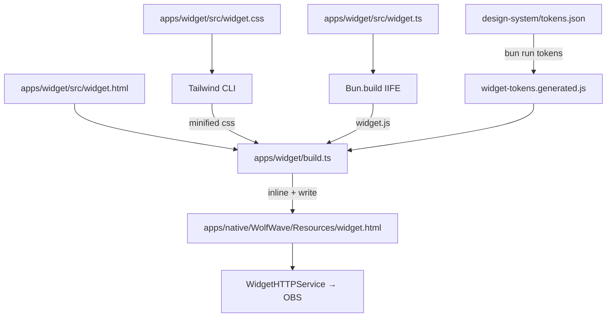

The WolfWave OBS overlay is a single self-contained HTML file that lives in
`apps/native/WolfWave/Resources/widget.html`. It's the file the native app
bundles and `WidgetHTTPService` serves to OBS Browser Source clients.

But you don't edit it directly. The widget's actual source is a Tailwind +
TypeScript workspace at `apps/widget/`, and the bundled HTML is a generated
artifact produced at build time.

## Architecture



Everything lands in one HTML file with `<style>`, the tokens `<script>`,
and the runtime `<script>` all inlined. No `<link>`, no `<script src>`,
no extra HTTP round-trips. Works in OBS Browser Source, works from `file://`,
works copied off the machine.

## Message contract

The widget consumes one-way WebSocket messages from
`WebSocketServerService.swift`. Schemas are frozen by the test suite — adding
fields server-side is safe, renaming fields requires a coordinated change.

| Type | Payload | Cadence |
|------|---------|---------|
| `welcome` | `{}` | Once on connect |
| `now_playing` | `{ track, artist, album, duration, elapsed, isPlaying, artworkURL }` | Track change |
| `progress` | `{ elapsed, duration, isPlaying }` | ~1 Hz |
| `playback_state` | `{ isPlaying, track?, artist?, album? }` | State change |
| `widget_config` | `{ theme, layout, textColor, backgroundColor, fontFamily }` | Settings change |

The widget never sends back. The native app pushes, the browser renders.

## Themes and layouts

Themes and layouts live in `design-system/tokens.json` under `widget.themes`
and `widget.layouts`. Six themes (Default, Dark, Light, Glass, Neon, WolfWave)
and three layouts (Horizontal, Vertical, Compact) ship in the box.

Themes are **not** compiled into utility variants. They stay as runtime CSS
custom properties, so an OBS user can swap themes via the `?theme=` URL
parameter without rebuilding anything. Tailwind utility classes resolve to
those CSS variables.

URL parameters:

- `?theme=Glass` — pick one of the six theme names
- `?layout=Vertical` — pick one of the three layout names
- `?token=<hex>` — auth token (auto-injected for loopback peers)
- `?duration=8` — auto-hide after N seconds (0 = never)
- `?hideAlbumArt` — render without the artwork tile

## Transitions

The container moves through a four-state machine. Class swaps are driven from
[`src/widget.ts → TRANSITIONS`](https://github.com/MrDemonWolf/wolfwave/blob/main/apps/widget/src/widget.ts):

| Trigger | Class path | Timing |
|---------|------------|--------|
| song starts | `widget-hidden` → `widget-entering` → `widget-visible` | 600 ms, bouncy `cubic-bezier(0.34, 1.56, 0.64, 1)` |
| song stops | `widget-visible` → `widget-exiting` → `widget-hidden` | 500 ms, calm `cubic-bezier(0.4, 0, 0.2, 1)` |
| track skip while visible | inner `.track-meta` + `.artwork` crossfade | 280 ms total |
| song stops | `.progress-fill.draining` width 0 | 400 ms ease-out |

The container animation does **not** re-trigger on track skip — that's
deliberate. Otherwise rapid skips strobe the stream.

Pause does **not** trigger the exit animation. Per the native
`AppleMusicSource.extractPlayerState` contract, only true stop
(`kPSS`) or an empty current track maps to `NOT_PLAYING`.

## File map

```
apps/widget/
├── src/
│   ├── widget.html       # HTML shell with %%TAILWIND_CSS%% / %%TOKENS_JS%% / %%WIDGET_JS%% placeholders
│   ├── widget.css        # @tailwind directives + custom state classes (transitions, progress, decorative layers)
│   └── widget.ts         # All runtime — state, transitions, WS, message dispatch, render
├── tailwind.config.ts    # Token-driven theme.extend; preflight + container disabled
├── postcss.config.js
├── build.ts              # Bundles JS, runs Tailwind, inlines into the template, writes the output file
├── package.json
└── README.md             # Mirrors this page (kept in sync intentionally)
```

The runtime source is heavily commented top-to-bottom, with banner sections
(`CONFIG`, `STATE`, `TRANSITIONS`, `RENDER`, `WEBSOCKET`, `MESSAGE HANDLERS`,
`BOOT`) and paragraph blocks on every non-trivial function. Read it linearly
to understand the whole widget.

## Dev loop

```bash
# Regenerate design tokens (only when tokens.json changes)
bun run tokens

# Rebuild the widget
bun run --filter widget build
```

The output is written to `apps/native/WolfWave/Resources/widget.html`. Open
that file directly in a browser to spot-check, or run the native app and
point your browser at `http://localhost:<widgetHTTPPort>/`.

### Automatic rebuilds

You don't usually need to run the command manually:

- **Xcode** — a pre-build Run Script phase (`Build OBS Widget (Tailwind → inline)`)
  runs `bun run --filter widget build` whenever any input file changes. If
  `bun` isn't on PATH the script exits 0 with a warning, so a fresh clone
  without the JS toolchain still builds — it just bundles whatever
  `widget.html` is committed.
- **CI** — both [`test.yml`](https://github.com/MrDemonWolf/wolfwave/blob/main/.github/workflows/test.yml)
  and [`build_release.yml`](https://github.com/MrDemonWolf/wolfwave/blob/main/.github/workflows/build_release.yml)
  set up Bun and rebuild the widget before invoking `xcodebuild`, so every
  shipped DMG carries a freshly-built widget.

## Security

The token is enforced as a WebSocket subprotocol, not a query parameter. The
native server (`WebSocketServerAuthTests`) rejects any client that doesn't
present `Sec-WebSocket-Protocol: wolfwave.token.<hex>` matching the
per-install token stored in the macOS Keychain.

For loopback peers, `WidgetHTTPService` substitutes the live token into the
served `widget.html` automatically. For LAN peers (two-PC streamers, phones),
the token must be appended manually to the URL — Settings → Stream Widgets
exposes the URL with the token baked in.

## See also

- [Architecture overview](/docs/architecture) — full system diagram
- [Development setup](/docs/development) — Xcode + dependencies
- [Security model](/docs/security) — auth tokens, sandboxing, IPC
