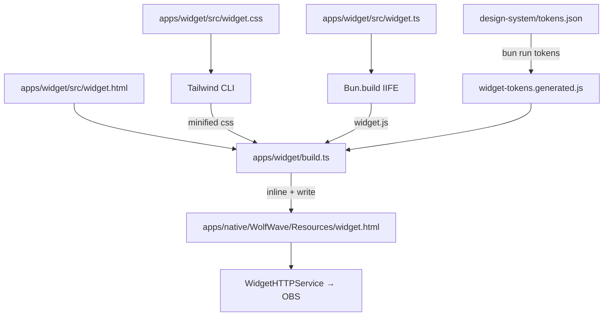

<span className="docs-eyebrow">Developers</span>

**The OBS overlay is one self-contained HTML file** at
`apps/native/WolfWave/Resources/widget.html`. The native app bundles it, and
`WidgetHTTPService` serves it to OBS Browser Source clients.

**Don't edit that file directly.** The real source is a Tailwind + TypeScript
workspace at `apps/widget/`. The bundled HTML is a generated artifact, produced
at build time.

## Architecture



Everything lands in one HTML file: `<style>`, the tokens `<script>`, and the
runtime `<script>` all inlined. No `<link>`, no `<script src>`, no extra HTTP
round-trips. Works in OBS Browser Source, from `file://`, and copied off the
machine.

## Message contract

The widget consumes one-way WebSocket messages from
`WebSocketServerService.swift`. Schemas are frozen by the test suite. Adding
fields server-side is safe, renaming fields requires a coordinated change.

| Type | Payload | Cadence |
|------|---------|---------|
| `welcome` | `{}` | Once on connect |
| `now_playing` | `{ track, artist, album, duration, elapsed, isPlaying, artworkURL }` | Track change |
| `progress` | `{ elapsed, duration, isPlaying }` | ~1 Hz |
| `playback_state` | `{ isPlaying, track?, artist?, album? }` | State change |
| `widget_config` | `{ theme, layout, textColor, backgroundColor, fontFamily }` | Settings change |

The widget never sends back. The native app pushes, the browser renders.

## Paused playback

When Music.app reports the loaded track as paused (`kPSp`), the widget stays
on stream. The card is **not** hidden. Instead:

- The widget root gains the `.is-paused` class
- Album artwork drops to ~55% opacity with reduced saturation
- A pause glyph overlays the artwork
- The progress loop suspends, so the bar freezes the moment pause arrives

The card only fades out on a genuine "track cleared" event (Music.app quits,
permission revoked, or tracking disabled). Hitting pause keeps the song
context visible so chat knows the integration is still healthy.

## Themes and layouts

**Six themes, three layouts, ready to go.** They live in
`design-system/tokens.json` under `widget.themes` and `widget.layouts`:

| Themes | Layouts |
|---|---|
| Default, Dark, Light, Glass, Neon, WolfWave | Horizontal, Vertical, Compact |

**Swap themes without rebuilding.** Themes aren't compiled into utility
variants. They arrive at runtime over the WebSocket (`widget_config`
messages), so changing the theme or layout in the app's **Stream Widgets**
settings restyles the overlay live. No URL edit, no rebuild, no OBS refresh.

**Preview before you commit.** The **Stream Widgets** settings pane (Widget
Appearance) shows a live preview right under the controls. Change a theme,
layout, font, or color and the preview updates as you go, so you can dial in the
look before copying the URL into OBS. Default and Glass expose the Text and
Background color pickers; the other themes ship fixed palettes.

**URL parameters:**

| Parameter | What it does |
|---|---|
| `?token=<hex>` | Auth token (auto-injected for loopback peers) |
| `?duration=8` | Auto-hide after N seconds (0 = never) |
| `?hideAlbumArt` | Render without the artwork tile |

Theme and layout aren't URL parameters. Set them in **Settings → Stream
Widgets** and the overlay follows along live.

## Transitions

The container moves through a four-state machine. Class swaps are driven from
[`src/widget.ts → TRANSITIONS`](https://github.com/MrDemonWolf/wolfwave/blob/main/apps/widget/src/widget.ts):

| Trigger | Class path | Timing |
|---------|------------|--------|
| song starts | `widget-hidden` → `widget-entering` → `widget-visible` | 600 ms, bouncy `cubic-bezier(0.34, 1.56, 0.64, 1)` |
| song stops | `widget-visible` → `widget-exiting` → `widget-hidden` | 500 ms, calm `cubic-bezier(0.4, 0, 0.2, 1)` |
| track skip while visible | inner `.track-meta` + `.artwork` crossfade | 280 ms total |
| song stops | `.progress-fill.draining` width 0 | 400 ms ease-out |

The container animation does **not** re-trigger on track skip. That's
deliberate. Otherwise rapid skips strobe the stream.

Pause does **not** trigger the exit animation. Per the native
`AppleMusicSource.extractPlayerState` contract, only true stop
(`kPSS`) or an empty current track maps to `NOT_PLAYING`.

## File map

```
apps/widget/
├── src/
│   ├── widget.html       # HTML shell with %%TAILWIND_CSS%% / %%TOKENS_JS%% / %%WIDGET_JS%% placeholders
│   ├── widget.css        # @tailwind directives + custom state classes (transitions, progress, decorative layers)
│   └── widget.ts         # All runtime. State, transitions, WS, message dispatch, render
├── tailwind.config.ts    # Token-driven theme.extend; preflight + container disabled
├── postcss.config.js
├── build.ts              # Bundles JS, runs Tailwind, inlines into the template, writes the output file
├── package.json
└── README.md             # Mirrors this page (kept in sync intentionally)
```

The runtime source is heavily commented top-to-bottom, with banner sections
(`CONFIG`, `STATE`, `TRANSITIONS`, `RENDER`, `WEBSOCKET`, `MESSAGE HANDLERS`,
`BOOT`) and paragraph blocks on every non-trivial function. Read it linearly
to understand the whole widget.

## Dev loop

```bash
# Regenerate design tokens (only when tokens.json changes)
bun run tokens

# Rebuild the widget
bun run --filter widget build
```

Output lands at `apps/native/WolfWave/Resources/widget.html`. To spot-check,
open that file directly in a browser, or run the native app and point your
browser at `http://localhost:<widgetHTTPPort>/`.

### Rebuilds happen for you

**You rarely run the build by hand:**

- **Xcode.** A pre-build Run Script phase (`Build OBS Widget (Tailwind → inline)`)
  runs `bun run --filter widget build` whenever an input file changes. No `bun`
  on PATH? The script exits 0 with a warning, so a fresh clone without the JS
  toolchain still builds. It just bundles whatever `widget.html` is committed.
- **CI.** Both [`test.yml`](https://github.com/MrDemonWolf/wolfwave/blob/main/.github/workflows/test.yml)
  and [`build_release.yml`](https://github.com/MrDemonWolf/wolfwave/blob/main/.github/workflows/build_release.yml)
  set up Bun and rebuild the widget before `xcodebuild`, so every shipped DMG
  carries a freshly-built widget.

## Security

**The token is a WebSocket subprotocol, not a query parameter.** The native
server (`WebSocketServerAuthTests`) rejects any client that doesn't present
`Sec-WebSocket-Protocol: wolfwave.token.<hex>` matching the per-install token
stored in the macOS Keychain.

- **Loopback peers:** `WidgetHTTPService` injects the live token into the served
  `widget.html` for you.
- **LAN peers** (two-PC streamers, phones): append the token to the URL
  yourself. Settings → Stream Widgets exposes the URL with the token already
  baked in.

## See also

- [Architecture overview](/docs/architecture). Full system diagram
- [Development setup](/docs/development). Xcode + dependencies
- [Security model](/docs/security). Auth tokens, sandboxing, IPC
