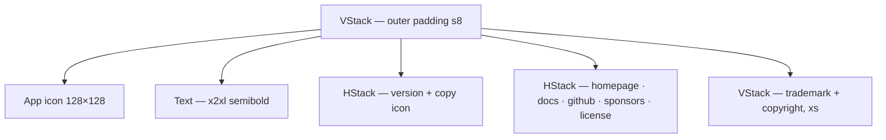

# AboutView

**File:** [`apps/native/WolfWave/Views/Shared/AboutView.swift`](../../apps/native/WolfWave/Views/Shared/AboutView.swift)

## Purpose
Standalone "About WolfWave" sheet — app icon, version string with copy affordance, links (homepage, docs, GitHub, sponsors, license), trademark + copyright footer. Shown from the menu bar and from the Help menu.

## API
```swift
AboutView()
```
No parameters — pulls app name/version from `Bundle.main` and link targets from `AppConstants`.

## Tokens used
- `DSFont.Size.x2xl` (22) — app name
- `DSFont.Size.body` (12) — version label + link row
- `DSFont.Size.sm` (11) — link separators
- `DSFont.Size.xs` (10) — trademark + copyright footnotes
- `DSSpace.s0` (2), `DSSpace.s8` (24) — vertical rhythm and outer padding

## Anatomy


## Accessibility
- Version row is tappable; `accessibilityLabel` describes "Copy version".
- Link separators (`·`) are decorative — VoiceOver should skip; underlying `Link` carries the destination.
- Footer copy is informational; no interactive elements.

## Do / Don't
- ✅ Open as a sheet or dedicated window — content assumes its own padding context.
- ✅ Keep version string single-line; truncation isn't styled.
- ❌ Don't embed inside another `Form` or `ScrollView` row.
- ❌ Don't fork copies for different surfaces — extend this view if you need new info.

## Example
```swift
.sheet(isPresented: $showAbout) {
    AboutView()
}
```
