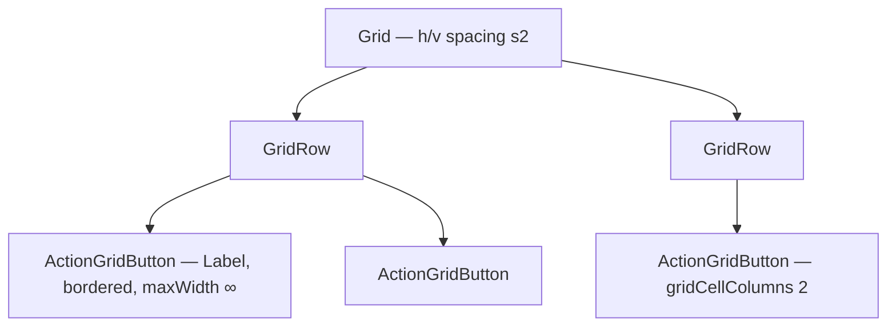

# ActionGrid

**File:** [`apps/native/wolfwave/Views/Shared/ActionGrid.swift`](../../apps/native/wolfwave/Views/Shared/ActionGrid.swift)

## Purpose
Standardized grid of bordered icon + label action buttons. Used by the custom About panel and the About settings tab to present a 2-column grid of secondary actions ("Check for Updates", "Release Notes", "Website", "Send Feedback", "Sponsor"). Replaces a hand-rolled `Grid` + private `actionButton(_:systemImage:action:)` helper that was duplicated across both About views.

## API
```swift
ActionGrid(columns: 2) {
    GridRow {
        ActionGridButton(title: "Check for Updates", systemImage: "arrow.down.circle", action: checkForUpdates)
        ActionGridButton(title: "Release Notes",     systemImage: "list.bullet.rectangle", action: openReleaseNotes)
    }
    GridRow {
        ActionGridButton(title: "Sponsor", systemImage: "heart.fill", action: openSponsor)
            .gridCellColumns(2)
    }
}
```

| Type | Param | Notes |
|---|---|---|
| `ActionGrid` | `columns: Int` | Logical column count. Default `2`. |
| `ActionGrid` | `content` | `@ViewBuilder` of `GridRow` blocks containing `ActionGridButton`s. |
| `ActionGridButton` | `title: String` | Visible label. |
| `ActionGridButton` | `systemImage: String` | SF Symbol shown beside the title. |
| `ActionGridButton` | `action: () -> Void` | Invoked on press. |
| `ActionGridButton` | `accessibilityIdentifier: String?` | Override for UI tests. Defaults to `"actionGrid.\(title)"`. |

A single button can span extra columns via `.gridCellColumns(_:)`.

## Tokens used
- `DSFont.Size.body` (13) / `.medium`
- `DSSpace.s0` (2) — button vertical padding
- `DSSpace.s2` (8) — grid horizontal + vertical spacing

## Anatomy


## Accessibility
- Each `ActionGridButton` is a standard `Button`; VoiceOver reads `title` as the label.
- `.accessibilityIdentifier` defaults to `actionGrid.<title>` so UI tests can target buttons without relying on visible copy.
- Uses `.pointerCursor()` so the macOS pointing-hand cursor appears on hover.
- `.frame(maxWidth: .infinity)` ensures buttons fill the grid cell so the layout stays balanced even if titles differ in length.

## Do / Don't
- ✅ Use for secondary actions in About-style panels (≤ 5 buttons total).
- ✅ Use `.gridCellColumns(2)` for a single emphasized button (e.g. "Sponsor on GitHub").
- ❌ Don't use as the primary CTA — primary actions belong outside the grid as `.borderedProminent`.
- ❌ Don't put more than ~6 buttons in one grid — the visual rhythm collapses.
- ❌ Don't hand-roll a `Grid { GridRow { Button { Label … } … } }` chain — use this component so future style updates land once.

## Example
```swift
ActionGrid(columns: 2) {
    GridRow {
        ActionGridButton(title: "Website", systemImage: "globe", action: openWebsite)
        ActionGridButton(title: "Send Feedback", systemImage: "envelope", action: sendFeedback)
    }
}
```
