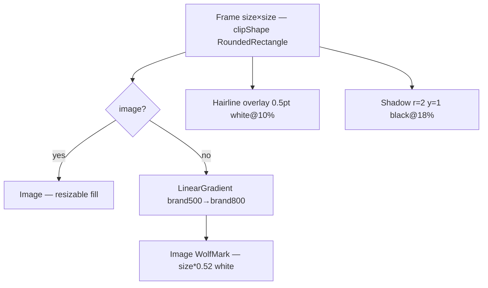

# AlbumArtView

**File:** [`apps/native/wolfwave/Views/Shared/AlbumArtView.swift`](../../apps/native/wolfwave/Views/Shared/AlbumArtView.swift)

## Purpose
Sized album-art tile with a WolfWave-branded fallback — the wolf mark on a brand-blue gradient — when no artwork is available. Used for every album thumbnail in the app — General hero, Discord preview, menu-bar header, queue rows, widget preview.

## API
```swift
AlbumArtView(image: nil, size: 92)
```

| Param | Type | Notes |
|---|---|---|
| `image` | `NSImage?` | Real artwork. Nil triggers the branded fallback. |
| `size` | `CGFloat` | Square edge in points. 36 / 64 / 92 are the documented sizes. |
| `cornerRadius` | `CGFloat?` | Override the default radius (`max(4, size * 0.10)`). |

## Tokens used
- `DSColor.brand500` → `DSColor.brand800` — fallback gradient (topLeading→bottomTrailing)
- `DSRadius.sm`–`DSRadius.lg` (4–10) — radius derived as `size * 0.10` (≥4)
- Hairline overlay stroke (`white opacity 0.10`, 0.5pt) — separation from any background
- Drop shadow `rgba(0,0,0,0.18)` r=2 y=1 — lifts the tile
- `WolfMark` template image, tinted white, at `size * 0.52`

## Anatomy


## Accessibility
- Decorative — no `accessibilityLabel`. The parent (e.g. `NowPlayingHeroCard`) is the labelled element.
- The branded fallback is a fixed asset + static gradient — no per-render computation.

## Do / Don't
- ✅ Pass real artwork when available — `ArtworkService` resolves iTunes Search URLs and caches them.
- ✅ Let the fallback render as-is — it is intentionally identical for every song.
- ❌ Don't stretch with a non-square frame — the tile is clipped square at `size × size`.
- ❌ Don't swap the `WolfMark` asset for a generic glyph — the branded mark is the point of the fallback.

## Example
```swift
AlbumArtView(
    image: nowPlaying?.artwork,
    size: 64
)
```

> The OBS widget (`Resources/widget.html`, `artImg`) mirrors this fallback with an inline copy of the `WolfMark` SVG on the same brand gradient — keep the two in sync.
