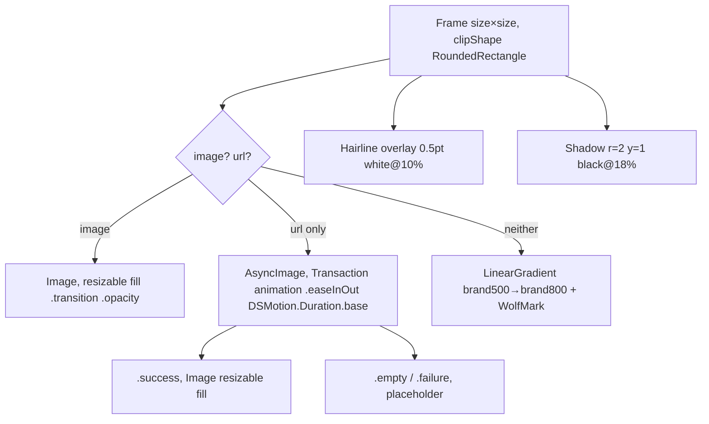

# AlbumArtView

**File:** [`apps/native/WolfWave/Views/Shared/AlbumArtView.swift`](../../apps/native/WolfWave/Views/Shared/AlbumArtView.swift)

## Purpose
Sized album-art tile with a WolfWave-branded fallback (the wolf mark on a brand-blue gradient) when no artwork is available. Used for every album thumbnail in the app: General hero, Discord preview, menu-bar header, queue rows, widget preview.

## API
```swift
// Direct image (cache hit / preloaded)
AlbumArtView(image: nsImage, size: 92)

// Phased URL load (cold cache, remote artwork)
AlbumArtView(url: artworkURL, size: 92)

// Fallback only
AlbumArtView(size: 92)
```

| Param | Type | Notes |
|---|---|---|
| `image` | `NSImage?` | Real artwork. Takes precedence over `url`. Nil + nil `url` triggers branded fallback. |
| `url` | `URL?` | Remote artwork. Used only when `image == nil`. Drives `AsyncImage` with phased fade-in. |
| `size` | `CGFloat` | Square edge in points. 36 / 64 / 92 are the documented sizes. |
| `cornerRadius` | `CGFloat?` | Override the default radius (`max(4, size * 0.10)`). |

## Tokens used
- `DSColor.brand500` → `DSColor.brand800`: fallback gradient (topLeading→bottomTrailing)
- `DSRadius.sm`–`DSRadius.lg` (4–10): radius derived as `size * 0.10` (≥4)
- `DSMotion.Duration.base` (0.22): `AsyncImage` `Transaction` animation duration on `url` path, gated by `@Environment(\.accessibilityReduceMotion)`
- Hairline overlay stroke (`white opacity 0.10`, 0.5pt): separation from any background
- Drop shadow `rgba(0,0,0,0.18)` r=2 y=1: lifts the tile
- `WolfMark` template image, tinted white, at `size * 0.52`

## Loading paths

| `image` | `url` | Renders |
|---|---|---|
| non-nil | _any_ | `Image(nsImage:)` with `.transition(.opacity)` for cross-fade when caller swaps the binding |
| nil | non-nil | `AsyncImage`: `.empty`/`.failure` → branded gradient placeholder; `.success` → image fades in over `DSMotion.Duration.base` |
| nil | nil | Branded gradient + `WolfMark` |

The URL path lets callers skip explicit cache management for one-off artwork (Discord preview, queue rows). For now-playing hero where `ArtworkService.shared` already caches `NSImage` results, prefer the `image:` parameter to avoid double-fetching.

## Anatomy


## Accessibility
- Decorative (no `accessibilityLabel`). The parent (e.g. `NowPlayingHeroCard`) is the labelled element.
- The branded fallback is a fixed asset + static gradient. No per-render computation.
- Reduce Motion: `AsyncImage` `Transaction.animation` is set to `nil`, so the URL path swap-in is instant.

## Do / Don't
- ✅ Pass real artwork when available; `ArtworkService` resolves iTunes Search URLs and caches them.
- ✅ Let the fallback render as-is. It is intentionally identical for every song.
- ❌ Don't stretch with a non-square frame. The tile is clipped square at `size × size`.
- ❌ Don't swap the `WolfMark` asset for a generic glyph. The branded mark is the point of the fallback.

## Example
```swift
AlbumArtView(
    image: nowPlaying?.artwork,
    size: 64
)
```

> The OBS widget (`Resources/widget.html`, `artImg`) mirrors this fallback with an inline copy of the `WolfMark` SVG on the same brand gradient. Keep the two in sync.
