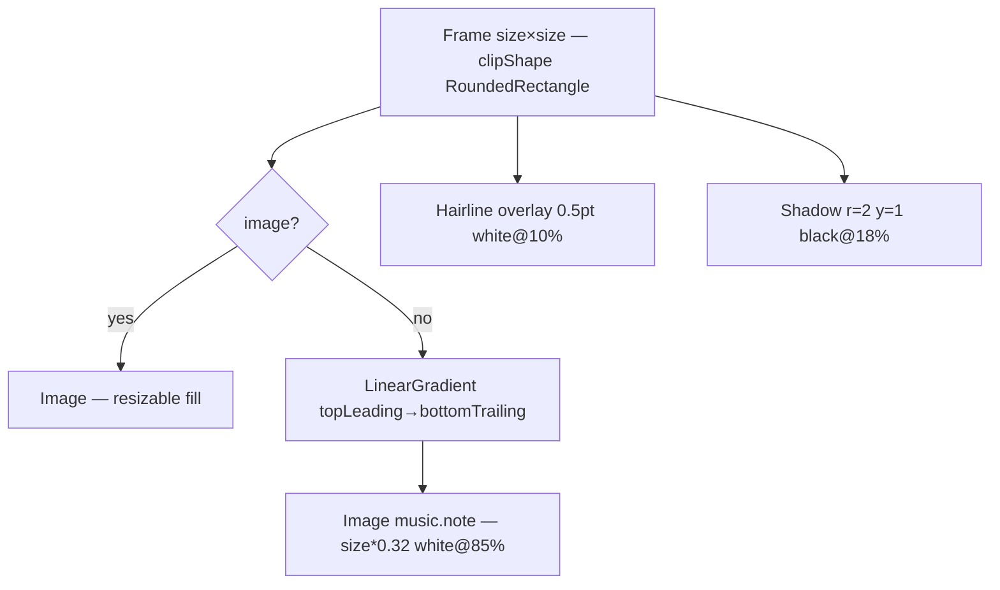

# AlbumArtView

**File:** [`apps/native/wolfwave/Views/Shared/AlbumArtView.swift`](../../apps/native/wolfwave/Views/Shared/AlbumArtView.swift)

## Purpose
Sized album-art tile with a deterministic hashed-gradient fallback when no artwork is available. Used for every album thumbnail in the app — General hero, Discord preview, menu-bar header, queue rows, widget preview.

## API
```swift
AlbumArtView(image: nil, seed: "Anti-Hero — Taylor Swift", size: 92)
```

| Param | Type | Notes |
|---|---|---|
| `image` | `NSImage?` | Real artwork. Nil triggers the gradient fallback. |
| `seed` | `String` | Deterministic input for the fallback hue. Convention: `"\(track)—\(artist)"`. |
| `size` | `CGFloat` | Square edge in points. 36 / 64 / 92 are the documented sizes. |
| `cornerRadius` | `CGFloat?` | Override the default radius (`max(4, size * 0.10)`). |

## Tokens used
- `DSRadius.sm`–`DSRadius.lg` (4–10) — radius derived as `size * 0.10` (≥4)
- Hairline overlay stroke (`white opacity 0.10`, 0.5pt) — separation from any background
- Drop shadow `rgba(0,0,0,0.18)` r=2 y=1 — lifts the tile
- Music-note fallback glyph at `size * 0.32`, white@85%

## Anatomy


## Accessibility
- Decorative — no `accessibilityLabel`. The parent (e.g. `NowPlayingHeroCard`) is the labelled element.
- Hashed gradient is cached (`gradientCache`, cap 64) so identical seeds skip the HSL conversion on every redraw.

## Do / Don't
- ✅ Use the same seed (`"\(track)—\(artist)"`) across views so the same song shows the same fallback colour.
- ✅ Pass real artwork when available — `ArtworkService` resolves iTunes Search URLs and caches them.
- ❌ Don't pass dynamic random seeds — gradient should be stable for a given song.
- ❌ Don't stretch with a non-square frame — the tile is clipped square at `size × size`.

## Example
```swift
AlbumArtView(
    image: nowPlaying?.artwork,
    seed: "\(nowPlaying?.track ?? "")—\(nowPlaying?.artist ?? "")",
    size: 64
)
```
