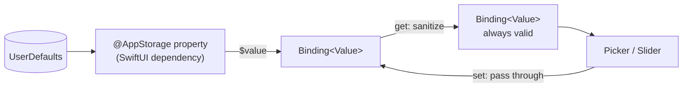

# Binding+Sanitized

**File:** [`apps/native/WolfWave/Views/Shared/Binding+Sanitized.swift`](../../apps/native/WolfWave/Views/Shared/Binding+Sanitized.swift)

Guards for `@AppStorage`-backed controls whose persisted value may fall outside
what the control accepts.

## Purpose

A `Picker` needs its selection to match one of its tags, and a `Slider` needs its
value inside its bounds. `@AppStorage` gives neither guarantee: it hands the
control whatever is on disk. A hand-edited plist, `defaults write`, a key written
by an older build, or a test process sharing the app's domain can all put a value
there that the control cannot represent.

That is not a cosmetic problem. A segmented `Picker` given an unmatched selection
traps *inside SwiftUI*, taking the whole settings window down, after logging only:

```
Picker: the selection "1" is invalid and does not have an associated tag
Fatal error: Double value cannot be converted to Int because the result would be greater than Int.max
```

Because the trap is in framework code rather than app code, no lint rule and no
amount of care at the call site would have caught it. The fix has to be to stop
the bad value reaching the control.

Use these at every `@AppStorage`-backed `Picker`. Sliders normally get the same
protection for free from [`LabeledSlider`](labeled-slider.md); reach for
`clamped(to:fallback:)` only when a layout genuinely can't use that component.

## API

```swift
extension Binding where Value == Int {
    func snapped(to allowed: [Int], fallback: Int) -> Binding<Int>
}

extension Binding where Value == Double {
    func clamped(to range: ClosedRange<Double>, fallback: Double) -> Binding<Double>
}

extension Binding where Value == String {
    func snapped(to allowed: [String], fallback: String) -> Binding<String>
}
```

The `String` variant covers raw-value pickers (`StatsWindow`, `WolfWaveReplyStyle`).
Its symptom is milder — an unmatched selection renders an empty picker rather
than trapping — but it is the same defect, so it uses the same helper.

Both delegate to the pure `Preferences.resolveAllowed` / `Preferences.resolveClamped`,
which are the same functions `Preferences.resolvedInt` / `resolvedDouble` use for
service-side reads, so the UI and the read path cannot drift.

## Tokens used

None. This is a data-sanitizing `Binding` extension with no visual output.

## Why a derived Binding, and not the alternatives

| Approach | Why not |
|---|---|
| Repair the value in `onAppear` | Too late. `body` runs — and traps — before `onAppear` fires. |
| Replace `@AppStorage` with `@State` + manual load | Loses the SwiftUI dependency, so the view stops updating when defaults change underneath it. |
| A custom `@SanitizedAppStorage` property wrapper | A whole new property wrapper for what a ten-line `Binding` extension does. |

Wrapping the *projected value* keeps the `@AppStorage` property as the view's
SwiftUI dependency, so external changes still invalidate the view, while the
getter guarantees the control never sees an invalid value — including on first
render.

## Anatomy



## Accessibility

- Prevents invalid persisted values from crashing a `Picker` or `Slider` before assistive technology can reach it.
- Adds no accessibility element or label; the wrapped control remains responsible for its own semantics.
- Preserves the control's live binding, so VoiceOver hears the same current value shown on screen.

## Do / Don't

- ✅ Hoist the tag list to a `private static let` and pass it to both the `ForEach` and `snapped(to:)`, so a tag can't exist in one and not the other.
- ✅ Use the key's own default from `AppConstants.UserDefaults.Defaults` as the `fallback`.
- ❌ Don't heal the stored value in the setter. Writes pass through unchanged; drawing a view must not rewrite what's on disk.
- ❌ Don't use `snapped` where `0` is a sentinel meaning "unset" but also a valid tag (History's "Forever" retention). The allowlist is correct there; `Preferences.int`'s `≤ 0 means unset` rule is not.

## Example

```swift
private static let windowOptions = [30, 60, 90, 120]

Picker(
    "",
    selection: $windowSeconds.snapped(
        to: Self.windowOptions,
        fallback: AppConstants.UserDefaults.Defaults.voteSkipWindowSeconds)
) {
    ForEach(Self.windowOptions, id: \.self) { seconds in
        Text("\(seconds)s").tag(seconds)
    }
}
.pickerStyle(.segmented)
```
