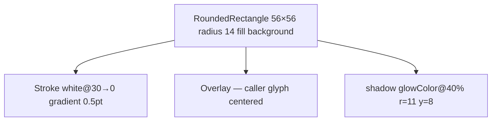

# BrandTile

**File:** [`apps/native/WolfWave/Views/Onboarding/Components/BrandTile.swift`](../../apps/native/WolfWave/Views/Onboarding/Components/BrandTile.swift)

## Purpose
56×56 rounded-square brand mark used as the visual anchor at the top of each onboarding integration step (Twitch, Discord, Apple Music). Solid or gradient fill, inner light highlight, soft brand-tinted glow, centered glyph.

## API
```swift
BrandTile(
    background: LinearGradient(
        colors: [DSColor.partnerAppleMusicStart, DSColor.partnerAppleMusicEnd],
        startPoint: .top,
        endPoint: .bottom
    ),
    glowColor: DSColor.partnerAppleMusicStart,
    glyph: Image(systemName: "music.note")
        .font(.system(size: 28, weight: .semibold))
        .foregroundStyle(.white)
)
```

| Param | Type | Notes |
|---|---|---|
| `background` | `Background: ShapeStyle` | Generic over `ShapeStyle` — pass a `Color` or `LinearGradient` directly. |
| `glowColor` | `Color` | Drop-shadow tint (`opacity 0.40`, r=11, y=8). |
| `glyph` | `Glyph: View` | Centered content. Usually `Image` (SF Symbol or asset) tinted white. |

## Tokens used
- `DSDimension.Onboarding.brandTileSize` (56) — width × height
- `DSDimension.Onboarding.brandTileRadius` (14) — corner radius
- Hairline overlay: `white@30%` → `white@0%` top-to-bottom, 0.5pt stroke
- Shadow: `glowColor @ 0.40`, r=11, y=8
- Glyph convention: SF Symbol ~28pt, white foreground

## Anatomy


## Accessibility
- Decorative — `.accessibilityHidden(true)` by default. Pair with a labelled step heading.
- Don't read the brand name twice (tile + step title) — the title is the labelled element.

## Do / Don't
- ✅ One tile per onboarding step, top-centered above the step heading.
- ✅ Pair brand colour + glow + glyph from the same partner palette (`DSColor.partnerTwitch`, etc.).
- ❌ Don't reuse outside onboarding — the size and glow are tuned for that wizard's vertical rhythm.
- ❌ Don't supply a tinted glyph in a non-white colour — the inner highlight expects white-on-brand contrast.

## Example
```swift
BrandTile(
    background: DSColor.partnerTwitch,
    glowColor: DSColor.partnerTwitch,
    glyph: TwitchGlitchShape()
        .fill(style: FillStyle(eoFill: true))
        .foregroundStyle(.white)
        .frame(width: 28, height: 28)
)
```
