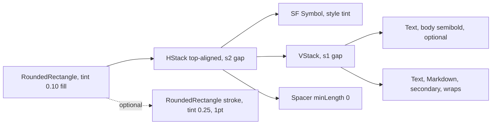

# CalloutBanner

**File:** [`apps/native/WolfWave/Views/Shared/CalloutBanner.swift`](../../apps/native/WolfWave/Views/Shared/CalloutBanner.swift)

## Purpose
Inline tinted callout that flags a state (info / success / warning / error / neutral) inside a settings pane. One component for every "icon + text in a tinted rounded box" pattern, so tint, icon, and corner radius all resolve from a single place. Supersedes the old `WarningBanner`, which only covered orange/red warnings and led call sites to hand-roll info/success variants with drifting radii and tint opacities.

## API
```swift
CalloutBanner("Updates are managed by Homebrew.", style: .info)
CalloutBanner("Viewers type **!sr song name**.", title: "How it works", style: .info)
CalloutBanner("Auto-updates on. We'll notify you of new versions.", style: .success)
CalloutBanner("Deleting the queue cannot be undone.", style: .error)
CalloutBanner("These tools mutate live state. Use at your own risk.", strokeVisible: true) // .warning default
```

| Param | Type | Default | Notes |
|---|---|---|---|
| `message` | `String` | (required) | First positional arg. Parsed as **Markdown** so inline `**bold**` renders. Wraps via `.fixedSize(vertical: true)`. |
| `title` | `String?` | `nil` | Optional bold lead line above the body (e.g. "How it works"). |
| `style` | `Style` | `.warning` | `.info` / `.success` / `.warning` / `.error` / `.neutral`. Drives the tint and default icon. |
| `systemImage` | `String?` | `nil` | Overrides the style's default SF Symbol (e.g. `"hammer.fill"`). |
| `strokeVisible` | `Bool` | `false` | Overlays a 1pt stroke at 25% tint. Reserved for high-attention areas (Debug tab). |

### Style maps to tint plus icon
| Style | Tint | Default icon |
|---|---|---|
| `.info` | `DSColor.info` | `info.circle.fill` |
| `.success` | `DSColor.success` | `checkmark.circle.fill` |
| `.warning` | `DSColor.warning` | `exclamationmark.triangle.fill` |
| `.error` | `DSColor.error` | `exclamationmark.octagon.fill` |
| `.neutral` | `.secondary` | `info.circle.fill` |

## Tokens used
- `DSFont.Size.body` (13): message with no title, and the title line
- `DSFont.Size.sm` (11): message when a `title` is present
- `DSSpace.s1` (4): title/message gap
- `DSSpace.s2` (8): vertical padding and icon/text gap
- `DSSpace.s4` (12): horizontal padding
- `AppConstants.SettingsUI.cardCornerRadius` (14): clip and stroke shape
- `DSColor.info` / `.success` / `.warning` / `.error`: semantic tints

## Anatomy


## Accessibility
- `.accessibilityElement(children: .combine)` collapses icon, title, and message into one VoiceOver element; the rendered (de-marked) text is read, so Markdown asterisks are not spoken.
- The icon is `.accessibilityHidden`. Tint is decorative; the copy always carries the meaning.
- Dynamic Type: the message uses `.fixedSize(horizontal: false, vertical: true)` so it wraps cleanly.

## Do / Don't
- ✅ Pick the `style` that matches the meaning: `.info` for tips, `.warning` for caution, `.error` for destructive, `.success` for confirmation, `.neutral` for a muted note.
- ✅ Use `title:` for a short bold lead line; keep the body to one idea.
- ✅ Reach for `CalloutBanner` before drawing your own tinted callout chrome.
- ❌ Don't embed interactive buttons inside the banner. Render the button as a sibling above or below (see `MusicPermissionBanner`).
- ❌ Don't use it when no tint or background is needed. Use `HintRow` for a plain footnote tip.
- ❌ Don't set `strokeVisible: true` for routine callouts. Reserve the stroke for high-attention surfaces.

## Example
```swift
CalloutBanner(
    "WolfWave can't read the currently playing track. Enable Apple Music automation in System Settings.",
    style: .warning
)
```
