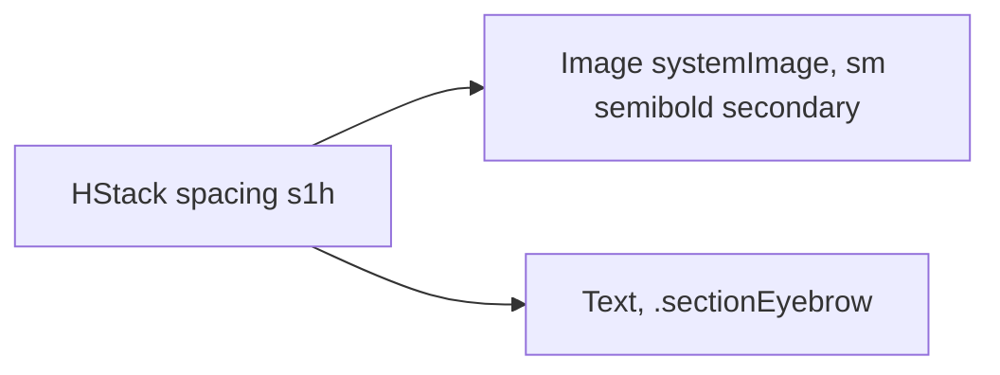

# CardEyebrowHeader

**File:** [`apps/native/WolfWave/Views/Shared/CardEyebrowHeader.swift`](../../apps/native/WolfWave/Views/Shared/CardEyebrowHeader.swift)

## Purpose
Small in-card section header: an SF Symbol plus a sentence-case eyebrow label, tagged as an accessibility header. The one source of truth for the "icon + eyebrow" header that had drifted into private `cardHeader` / `chartCardHeader` copies across History & Stats.

## API
```swift
CardEyebrowHeader("Top artists", systemImage: "music.mic")
```

| Param | Type | Notes |
|---|---|---|
| `title` | `String` | First (unlabeled) argument. Sentence case; `.sectionEyebrow()` handles casing/tracking. |
| `systemImage` | `String` | Leading SF Symbol name. Rendered `.secondary`, semibold. |

## Tokens used
- `DSSpace.s1h` (6): icon ↔ label gap
- `DSFont.Size.sm` (11): icon glyph size
- `.secondary` foreground style: icon + (via `.sectionEyebrow()`) label

## Anatomy


## Accessibility
- The whole row carries `.accessibilityAddTraits(.isHeader)` so VoiceOver users can navigate by heading.
- The glyph is decorative; the eyebrow text conveys the section name.

## Do / Don't
- ✅ Use as the first row inside a settings/stats card.
- ✅ Pair with a one-word-or-two sentence-case title.
- ❌ Don't use without an icon. A plain text eyebrow should call `.sectionEyebrow()` directly.
- ❌ Don't nest inside another header.

## Example
```swift
VStack(alignment: .leading, spacing: DSSpace.s2) {
    CardEyebrowHeader("Listening time", systemImage: "clock")
    // … card body …
}
```
