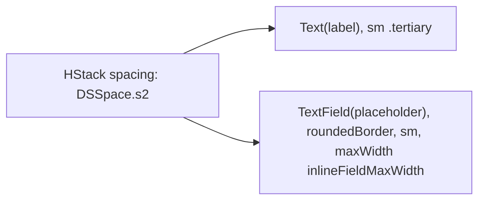

# CommandAliasField

**File:** [`apps/native/WolfWave/Views/Shared/CommandAliasField.swift`](../../apps/native/WolfWave/Views/Shared/CommandAliasField.swift)

## Purpose
A compact "Custom aliases:" label paired with a rounded text field, where viewers' extra trigger names (comma-separated, no leading `!`) are entered. One shared layout for every chat-command settings row, extracted from the copies that previously lived in the Twitch, Song Request, History, and vote-skip panes.

## API
```swift
CommandAliasField(
    aliases: $songCommandAliases,
    placeholder: "e.g. np, track",
    accessibilityLabel: "Custom aliases",
    accessibilityIdentifier: "songCommandAliases"
)
```

| Param | Type | Notes |
|---|---|---|
| `aliases` | `Binding<String>` | Comma-separated alias list. |
| `label` | `String` | Default `"Custom aliases:"`. |
| `placeholder` | `String` | Default `"e.g. np, track"`. |
| `accessibilityLabel` | `String` | Default `"Custom aliases"`; override per pane (e.g. `"Stats command aliases"`). |
| `accessibilityIdentifier` | `String?` | Applied only when non-nil, so rows that don't need unique targeting emit none. |

## Tokens used
| Token | Where |
|---|---|
| `DSSpace.s2` | HStack spacing |
| `DSFont.Size.sm` (11) | label (`.tertiary`) + field text |
| `AppConstants.SettingsUI.inlineFieldMaxWidth` (200) | field max width |

## Anatomy


## Accessibility
- VoiceOver reads `accessibilityLabel`; identifier is applied only when supplied.
- Field caps at `inlineFieldMaxWidth` so it sits at the trailing edge instead of stretching the card.

## Do / Don't
- ✅ Use inside a [`CommandSettingRow`](command-setting-row.md) details block, or standalone in a command card (e.g. vote-skip, `!stats`).
- ✅ Give each instance a unique `accessibilityIdentifier` when more than one alias field shares a pane.
- ❌ Don't re-roll the label+field inline. Use this so every alias input matches.
- ❌ Don't widen past `inlineFieldMaxWidth`.

## Example
```swift
CommandAliasField(
    aliases: $statsCommandAliases,
    placeholder: "e.g. nowstats, mystats",
    accessibilityLabel: "Stats command aliases",
    accessibilityIdentifier: "statsCommandAliases"
)
```
