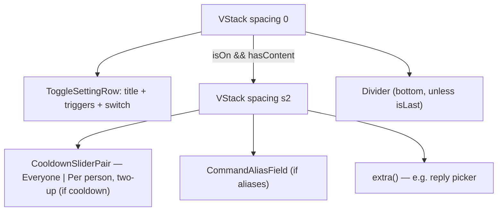

# CommandSettingRow

**File:** [`apps/native/WolfWave/Views/Shared/CommandSettingRow.swift`](../../apps/native/WolfWave/Views/Shared/CommandSettingRow.swift)

## Purpose
One chat-command row for the "list inside a card" settings pattern: a toggle (command name + trigger list + switch) that, when on, reveals a single compact details block — Everyone/Per-person cooldown sliders, a "Custom aliases" field, and any caller-supplied `extra` content. Replaces the per-pane copies that previously lived in the Twitch and Song Request settings.

## API
```swift
CommandSettingRow(
    title: "!song Command",
    triggers: "!song  ·  !currentsong  ·  !nowplaying",
    isOn: $currentSongCommandEnabled,
    accessibilityLabel: "Enable Current Playing Song command",
    accessibilityIdentifier: "currentSongCommandToggle",
    cooldown: .init(global: $songGlobalCooldown, user: $songUserCooldown),
    aliases: $songCommandAliases,
    aliasAccessibilityIdentifier: "songCommandAliases",
    onChange: { enabled in /* side-effect */ }
)

// Trailing `extra` slot (e.g. the !wolfwave reply picker):
CommandSettingRow(title: …, triggers: …, isOn: …, accessibilityLabel: …,
                  accessibilityIdentifier: …, isLast: true) {
    wolfwaveReply            // any View
}

// Cooldown config bag:
CommandCooldown(global: Binding<Double>, user: Binding<Double>,
                globalRange: 0...30, userRange: 0...60, step: 5)
```

| Param | Type | Notes |
|---|---|---|
| `title` | `String` | Command name, e.g. `"!song Command"`. |
| `triggers` | `String` | Subtitle line — the trigger list, or a one-line explanation for a non-command toggle. |
| `isOn` | `Binding<Bool>` | Enable state; drives whether the details block shows. |
| `accessibilityLabel` / `accessibilityIdentifier` | `String` | Required — for the toggle. Cooldown sliders derive `"\(id).everyoneCooldown"` / `.perUserCooldown`. |
| `cooldown` | `CommandCooldown?` | `nil` → no sliders. Renders the Everyone / Per-person pair two-up via [`CooldownSliderPair`](cooldown-slider-pair.md). |
| `aliases` | `Binding<String>?` | `nil` → no alias field. Renders [`CommandAliasField`](command-alias-field.md). |
| `aliasPlaceholder` / `aliasAccessibilityLabel` / `aliasAccessibilityIdentifier` | `String` / `String?` | Forwarded to `CommandAliasField`. |
| `isLast` | `Bool` | Suppresses the trailing hairline on the final row of the card. |
| `onChange` | `((Bool) -> Void)?` | Toggle side-effect (logging, service start/stop). |
| `extra` | `@ViewBuilder () -> Extra` | Trailing details content; defaults to `EmptyView` via the no-`extra` init. |

## Tokens used
- `DSSpace.s4` — toggle vertical padding (and details bottom); `s2` — toggle bottom when expanded + details inter-row spacing
- `AppConstants.SettingsUI.cardPadding` (16) — horizontal insets + divider leading inset
- Inherits `DSFont`/`DSSpace` from the composed `ToggleSettingRow`, `LabeledSlider`, `CommandAliasField`

## Anatomy


## Accessibility
- Toggle keeps the caller's `accessibilityLabel` / `accessibilityIdentifier` / `accessibilityValue`.
- Cooldown sliders auto-derive identifiers from the toggle id; alias field forwards its own.
- A toggle-only row (no cooldown / aliases / `extra`, `Extra == EmptyView`) renders just the switch — the details block and its padding are skipped, so VoiceOver hears no empty group.

## Do / Don't
- ✅ Stack rows in `VStack(spacing: 1) { … }.cardStyleUnpadded()` so hairlines align.
- ✅ Mark the final row `isLast: true`.
- ✅ Pass per-command pane-specific cooldown ranges via `CommandCooldown`.
- ❌ Don't add manual padding/dividers around it — the row owns both.
- ❌ Don't reintroduce a per-pane copy of the toggle/cooldown/alias rows; extend this instead.

## Example
```swift
VStack(spacing: 1) {
    CommandSettingRow(
        title: "!sr Command",
        triggers: "!sr  ·  !request  ·  !songrequest",
        isOn: $srCommandEnabled,
        accessibilityLabel: "Enable song request command",
        accessibilityIdentifier: "srCommandToggle",
        cooldown: .init(global: $globalCooldown, user: $userCooldown),
        aliases: $srAliases,
        aliasPlaceholder: "e.g. play, add",
        aliasAccessibilityIdentifier: "srCommandAliases"
    )
    CommandSettingRow(
        title: "!queue Command",
        triggers: "!queue  ·  !songlist  ·  !requests",
        isOn: $queueCommandEnabled,
        accessibilityLabel: "Enable queue command",
        accessibilityIdentifier: "queueCommandToggle",
        aliases: $queueAliases,
        aliasAccessibilityIdentifier: "queueCommandAliases",
        isLast: true
    )
}
.cardStyleUnpadded()
```
