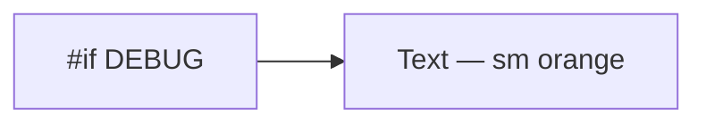

# ConfigRequiredBanner

**File:** [`apps/native/wolfwave/Views/Shared/ConfigRequiredBanner.swift`](../../apps/native/wolfwave/Views/Shared/ConfigRequiredBanner.swift)

## Purpose
DEBUG-only warning when a developer's `Config.xcconfig` is missing a required value (e.g. `DISCORD_CLIENT_ID`). Compiled out of Release builds entirely.

## API
```swift
ConfigRequiredBanner(message: "Set DISCORD_CLIENT_ID in Config.xcconfig to enable this feature.")
```

| Param | Type | Notes |
|---|---|---|
| `message` | `String` | Short imperative — name the key, name the file. |

## Tokens used
- `DSFont.Size.sm` (11) — body
- `.orange` foreground (semantic warning) — `DSColor.warning` (`#FF9F0A`) for consistency; current impl uses `.orange` literal
- `.transition(.opacity)` — appears/disappears with parent state changes

## Anatomy


That's it — no background, no border, no icon. Intentionally lightweight because Release builds compile it to nothing.

## Accessibility
- Reads as plain text. VoiceOver will narrate the warning verbatim.
- No interactive elements; if a user can fix the missing key from inside the app, link them via a separate Button.

## Do / Don't
- ✅ Use right under the section header for the affected feature.
- ✅ Name the exact key and the exact file (`Config.xcconfig`).
- ❌ Don't surface this in production — the `#if DEBUG` is load-bearing. Don't remove it.
- ❌ Don't use for runtime errors (network, auth) — use `StatusChip` + actionable copy in the integration row.

## Example
```swift
if AppConstants.Brand.discordClientID.isEmpty {
    ConfigRequiredBanner(message: "Set DISCORD_CLIENT_ID in Config.xcconfig to enable Discord Rich Presence.")
}
```
