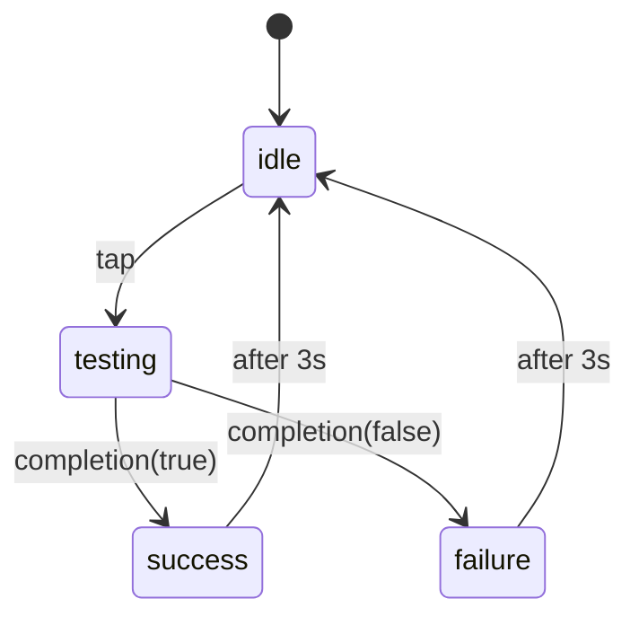
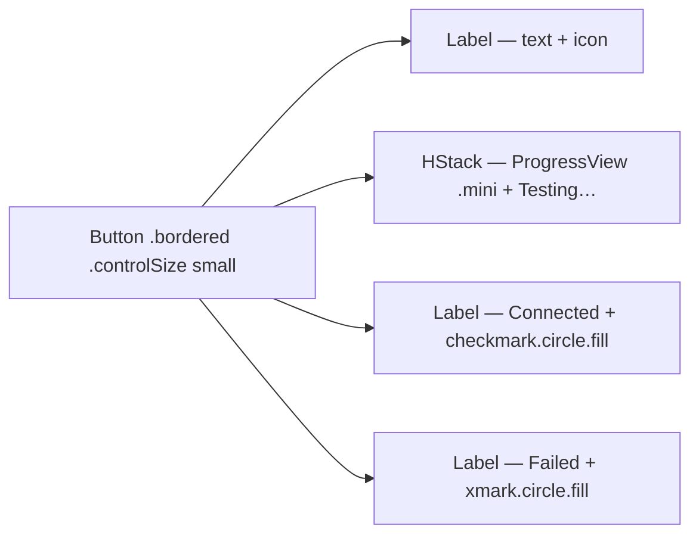

# ConnectionTestButton

**File:** [`apps/native/WolfWave/Views/Shared/ConnectionTestButton.swift`](../../apps/native/WolfWave/Views/Shared/ConnectionTestButton.swift)

## Purpose
Inline pill that runs a one-shot connection probe (idle → testing → success/failure → idle). Auto-resets after 3 seconds. Use for Discord, Twitch, or any service that can report a boolean result.

## API
```swift
ConnectionTestButton(label: "Check Discord", icon: "antenna.radiowaves.left.and.right") { completion in
    discordService.testConnection(completion: completion)
}
```

| Param | Type | Notes |
|---|---|---|
| `label` | `String` | Idle-state label. Imperative ("Check …", "Test …"). |
| `icon` | `String` | SF Symbol. Stays even during success/failure (those swap the symbol). |
| `action` | `(@escaping (Bool) -> Void) -> Void` | Caller invokes the `Bool` completion when finished. |

## Tokens used
- `DSFont.Size.body` (12) `.medium` — label
- `.bordered` button style with `tint` swap (`.green` success, `.red` failure)
- `.controlSize(.small)` — matches the height of inline form controls
- `.stableWidth { ... }` modifier — measures all four states and pins to the widest, so the button doesn't pop during transitions

## Motion

- `.symbolEffect(.bounce, value: result)` on the `checkmark.circle.fill` and `xmark.circle.fill` SF symbols — the icon bounces on the transition into success/failure for an immediate "done" cue.
- Animations on result swap use `withAnimation` (no DSMotion duration override — the default carries the bounce timing).
- Previews use `Task.sleep(for: .milliseconds(600))` instead of `DispatchQueue.main.asyncAfter` — keeps the demo on structured concurrency.

## State machine


## Anatomy


## Accessibility
- `accessibilityLabel` stays `label` (caller-supplied) across all four states.
- `accessibilityValue` reflects state ("Not tested" / "Testing" / "Connected" / "Failed") so VoiceOver narrates progress.
- Disabled while `testing` to prevent overlapping probes.

## Do / Don't
- ✅ Use for idempotent operations — pressing twice should be safe.
- ✅ Invoke the completion exactly once per `action` call.
- ❌ Don't use for destructive actions (sign-out, disconnect) — those need explicit buttons + confirmation.
- ❌ Don't extend the auto-reset; 3s is intentional so the row doesn't sit "stale green" for users to misread.

## Example
```swift
ConnectionTestButton(label: "Check Twitch", icon: "bubble.left.fill") { completion in
    Task {
        let ok = await twitchService.ping()
        await MainActor.run { completion(ok) }
    }
}
```
