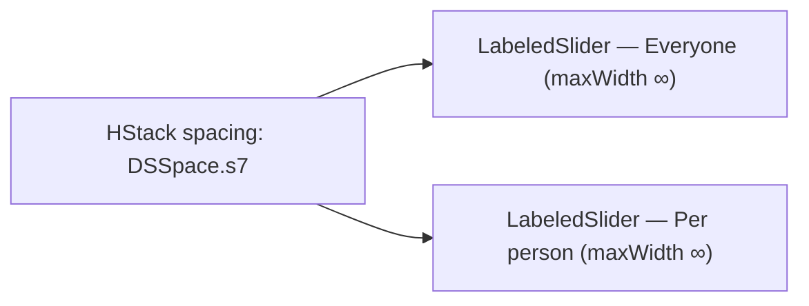

# CooldownSliderPair

**File:** [`apps/native/WolfWave/Views/Shared/CooldownSliderPair.swift`](../../apps/native/WolfWave/Views/Shared/CooldownSliderPair.swift)

## Purpose
The Everyone / Per-person cooldown sliders laid out **side by side** instead of stacked, so command rows that expose cooldowns stay compact (half the vertical space). Each column is a [`LabeledSlider`](labeled-slider.md) formatting as whole seconds ("15s") and splitting the row width evenly. Used by [`CommandSettingRow`](command-setting-row.md) (Twitch Bot Commands + Song Request Commands) and History's `!stats` card.

## API
```swift
CooldownSliderPair(
    everyone: .init(
        label: "Everyone",
        value: $songGlobalCooldown,
        range: 0...30,        // default 0...60
        step: 5,              // default 5
        accessibilityIdentifier: "songCommandToggle.everyoneCooldown"
    ),
    perPerson: .init(
        label: "Per person",
        value: $songUserCooldown,
        accessibilityIdentifier: "songCommandToggle.perUserCooldown"
    )
)

// Per-slider config bag:
CooldownSliderField(label: String, value: Binding<Double>,
                    range: 0...60, step: 5, accessibilityIdentifier: nil)
```

| Param | Type | Notes |
|---|---|---|
| `everyone` | `CooldownSliderField` | Left column — the global cooldown. |
| `perPerson` | `CooldownSliderField` | Right column — the per-user cooldown. |

## Tokens used
| Token | Where |
|---|---|
| `DSSpace.s7` (20) | gap between the two columns |
| Inherits `DSSpace.s3` / `DSFont.Size.sm` from the composed `LabeledSlider`s |

## Anatomy


## Accessibility
- Each column forwards its own `accessibilityIdentifier` to the underlying `LabeledSlider`.
- Both sliders format identically as whole seconds, so the readouts stay aligned in width.

## Do / Don't
- ✅ Use for the Everyone / Per-person cooldown pair inside a command card.
- ✅ Pass pane-specific ranges via each `CooldownSliderField`.
- ❌ Don't stack the two sliders vertically again — that's the layout this replaces.
- ❌ Don't drop into a pane narrower than ~300pt; the two columns need the width.

## Example
```swift
CooldownSliderPair(
    everyone: .init(label: "Everyone", value: $statsGlobalCooldown),
    perPerson: .init(label: "Per person", value: $statsUserCooldown)
)
```
