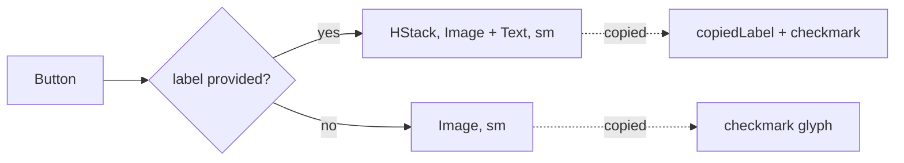

# CopyButton

**File:** [`apps/native/WolfWave/Views/Shared/CopyButton.swift`](../../apps/native/WolfWave/Views/Shared/CopyButton.swift)

## Purpose
Copy-to-clipboard button with a checkmark confirmation. Two variants: bordered (form rows) and borderless (compact inline use, e.g. URL row).

## API
```swift
CopyButton(text: "ws://localhost:9090", accessibilityLabel: "Copy URL")
```

| Param | Type | Notes |
|---|---|---|
| `text` | `String` | Pasteboard payload. |
| `label` | `String?` | Optional visible label. When provided, `copiedLabel` is required. |
| `copiedLabel` | `String?` | Replaces `label` for `feedbackDuration` seconds after the press. |
| `buttonStyle` | `CopyButtonStyle` | `.bordered` (default) or `.borderless`. |
| `isDisabled` | `Bool` | Locks the button. |
| `accessibilityLabel` | `String` | Required. |
| `accessibilityIdentifier` | `String?` | Optional UI-test hook. |
| `feedbackDuration` | `TimeInterval` | Default 2.0s. How long the checkmark stays. |
| `action` | `(() -> Void)?` | Optional side effect fired right after the copy (e.g. a parent status update). Pasteboard write + checkmark still happen regardless. |

## Tokens used
- `DSFont.Size.sm` (11): icon + label
- `.bordered` style + `.controlSize(.small)`: matches inline form controls
- `.borderless` style + `.pointerCursor()`: for inline trailing-edge use in URL rows
- Icons: `doc.on.doc` (idle) → `checkmark` (copied): semantic state swap

## Anatomy


## Accessibility
- `accessibilityLabel` describes the *target* of the copy ("Copy widget URL"), not the action.
- `accessibilityHint = "Copies text to clipboard"` always.
- `accessibilityValue` flips to `"Copied"` for `feedbackDuration` seconds; VoiceOver users get confirmation.
- `accessibilityIdentifier` is only applied when non-nil, so no empty-string identifier is emitted when omitted.
- Routes through the shared `Pasteboard.copy(_:)` helper (wraps `NSPasteboard.general`, the standard macOS clipboard).

## Do / Don't
- ✅ Use bordered variant in forms/rows where it sits next to a `TextField` or a value display.
- ✅ Use borderless inline with a URL or command text.
- ✅ Pair with a short `label`/`copiedLabel` ("Copy Link" / "Copied") for important affordances.
- ✅ Use `action:` to fire a parent side effect on copy (e.g. a "Code copied" status) instead of hand-rolling a bespoke copy button.
- ❌ Don't roll your own NSPasteboard call. Use this for the visual confirmation, or `Pasteboard.copy(_:)` when you only need the write.
- ❌ Don't reduce `feedbackDuration` below 1.5s; the checkmark needs to register.

## Example
```swift
CopyButton(
    text: widgetURL,
    label: "Copy Link",
    copiedLabel: "Copied",
    accessibilityLabel: "Copy widget URL",
    accessibilityIdentifier: "widget.copyURL"
)
```
