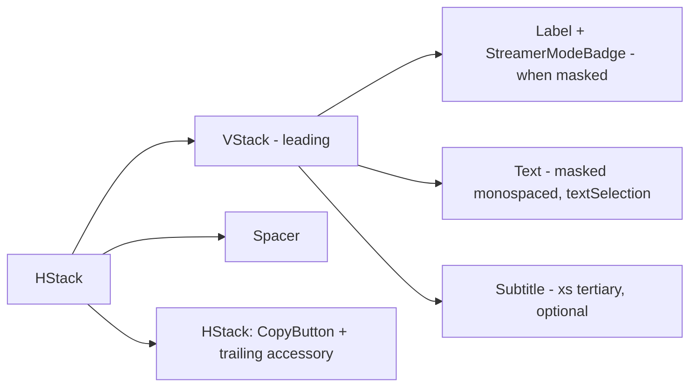

# CopyableURLRow

**File:** [`apps/native/WolfWave/Views/Shared/CopyableURLRow.swift`](../../apps/native/WolfWave/Views/Shared/CopyableURLRow.swift)

## Purpose
A settings row that shows a copyable URL - optional label + `StreamerModeBadge`, the URL in a masked monospaced font, an optional helper subtitle, and a trailing `CopyButton` (plus an optional accessory like `OpenInBrowserButton`). Folds the four hand-rolled masked-URL rows in Stream Widgets settings into one component so Streamer Mode masking, the badge guard, and the copy-disabled rule live in a single place.

## API
```swift
CopyableURLRow(
    label: "Local Address",
    url: connectionURL,
    isStreamerMode: streamerMode,
    actionsDisabled: !websocketEnabled,
    copyAccessibilityLabel: "Copy local connection URL",
    copyAccessibilityIdentifier: "copyConnectionURLButton"
)

// With a trailing "Open in browser" accessory + "Copy Link" labelled button:
CopyableURLRow(
    url: widgetURL,
    isStreamerMode: streamerMode,
    actionsDisabled: !websocketEnabled || !widgetHTTPEnabled,
    urlLineLimit: 2,
    copyLabel: "Copy Link",
    copiedLabel: "Copied",
    copyAccessibilityLabel: "Copy widget URL",
    copyAccessibilityIdentifier: "copyWidgetURLButton"
) {
    OpenInBrowserButton(
        urlString: widgetURL,
        isDisabled: !websocketEnabled || !widgetHTTPEnabled || streamerMode,
        accessibilityLabel: "Open widget in browser"
    )
}
```

| Param | Type | Notes |
|---|---|---|
| `label` | `String?` | Leading label (e.g. "Local Address"). `nil` leads straight into the URL. |
| `url` | `String` | Real URL - copied + handed to `trailing` verbatim; the displayed text is masked first. |
| `subtitle` | `String?` | Helper line under the URL (e.g. "Use this for two-PC setups."). |
| `isStreamerMode` | `Bool` | Drives the mask, the badge, and the disabled state. Pass `@AppStorage` streamer-mode flag. |
| `actionsDisabled` | `Bool` | Extra disable gate beyond Streamer Mode (e.g. server stopped). Default `false`. |
| `urlLineLimit` | `Int?` | `nil` wraps freely; pass `2` for wide rows with no trailing label column. |
| `copyLabel` / `copiedLabel` | `String?` | When `nil`, the copy button renders icon-only. |
| `copyAccessibilityLabel` | `String` | VoiceOver label for the copy button. |
| `copyAccessibilityIdentifier` | `String?` | UI-test identifier for the copy button. |
| `trailing` | `@ViewBuilder () -> Trailing` | Optional accessory after the copy button (e.g. `OpenInBrowserButton`). Defaults to `EmptyView`. |

## Tokens used
- `DSFont.Size.sm` (11) - label / `DSFont.Size.body` (12) monospaced URL / `DSFont.Size.xs` (10) subtitle
- `DSSpace.s2` (8) - row + label + trailing-button gaps
- `DSSpace.s0` (2) - vertical rhythm inside the text column
- Delegates the copy affordance to `CopyButton` and masking to `StreamerMode.mask(_:style:.url:)`

## Anatomy


## Accessibility
- The copy button carries its own VoiceOver label + value (via `CopyButton`); the URL `Text` is selectable.
- `StreamerModeBadge` announces "Streamer Mode is on" so a masked value reads as intentional, not empty.
- Copy + trailing actions are disabled together when `actionsDisabled || isStreamerMode`, so a masked URL can never be copied.
- Color is not the sole signal - the badge text and mask placeholder ("hidden (streamer mode)") both spell out the state.

## Do / Don't
- ✅ Use for any URL/endpoint a streamer might copy (WebSocket, widget webpage, network address).
- ✅ Pass the live `streamerMode` `@AppStorage` flag so the mask + disabled state track the toggle.
- ✅ Put extra trailing controls (open-in-browser) in the `trailing` slot, passing them the same `actionsDisabled || isStreamerMode` disabled state.
- ❌ Don't use it for secret tokens that should stay in a `SecureField` - this row always renders the value (masked) as selectable text.
- ❌ Don't wrap the URL in your own `StreamerMode.mask` before passing it - the row masks internally.

## Example
```swift
CopyableURLRow(
    label: "Network Address",
    url: networkConnectionURL,
    subtitle: "Use this for two-PC setups.",
    isStreamerMode: streamerMode,
    actionsDisabled: !websocketEnabled,
    copyAccessibilityLabel: "Copy network connection URL",
    copyAccessibilityIdentifier: "copyNetworkConnectionURLButton"
)
```
