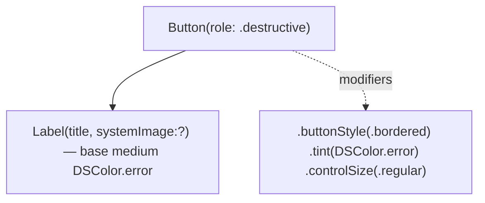

# DestructiveButton

Bordered destructive action button. Red text on transparent fill; the filled-red treatment is reserved for the primary action inside a confirm dialog.

## Purpose

HIG (macOS 26): filled-red is the primary action *inside* a confirm dialog, not the trigger that opens one. Settings rows that *invoke* destruction (Reset, Clear, Delete) should use a bordered button so the red reads as a warning, not a final commit. This component is the single source of truth so we don't drift back to `.borderedProminent` + `.tint(.red)` per call-site.

## API

```swift
DestructiveButton(
    title: String,
    systemImage: String? = nil,
    accessibilityIdentifier: String? = nil,
    action: () -> Void
)
```

## Tokens used

| Token | Where |
|---|---|
| `DSFont.Size.base` (13) | title |
| `DSColor.error` | tint + foreground |
| `DSSpace.s4` | preview stack spacing |

## Anatomy



## Accessibility

- `role: .destructive` so VoiceOver announces "destructive".
- Identifier defaults to `"destructiveButton.\(title)"`.
- Pointer cursor via shared `.pointerCursor()` helper.

## Do / Don't

- ✅ Use for any row-level destructive trigger (Reset, Clear, Delete).
- ✅ Pair with a `.confirmationDialog` whose primary action is the filled-red `Button(role: .destructive)` default.
- ❌ Don't use `.borderedProminent` + `.tint(.red)` — that's the dialog primary, not the trigger.
- ❌ Don't wrap in a red-tinted card; the bordered red of this button reads as the warning surface on its own.

## Example

```swift
DestructiveButton(
    title: "Reset All Settings to Defaults",
    systemImage: "trash"
) {
    showingResetAlert = true
}
.confirmationDialog("Reset all settings?", isPresented: $showingResetAlert) {
    Button("Reset", role: .destructive) { performReset() }
    Button("Cancel", role: .cancel) { }
}
```
