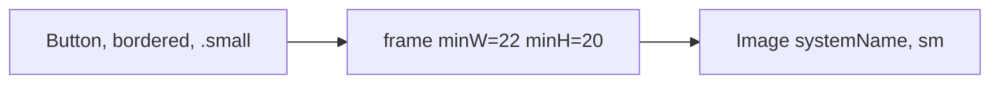

# DSIconButton

**File:** [`apps/native/WolfWave/Views/Shared/DSIconButton.swift`](../../apps/native/WolfWave/Views/Shared/DSIconButton.swift)

## Purpose
Single-glyph bordered button sized to height-match `CopyButton` and other `.bordered .small` controls. Use it whenever you'd otherwise hand-roll `Button { Image(systemName:) } .buttonStyle(.bordered) .controlSize(.small)`. Hand-rolled icon buttons collapse to a narrower frame than their text-label neighbors, which is why eye/copy pairs visually drift.

## API
```swift
DSIconButton(
    systemImage: "eye",
    action: { isRevealed.toggle() },
    accessibilityLabel: "Reveal token",
    accessibilityIdentifier: "websocketTokenRevealButton"
)
```

| Param | Type | Notes |
|---|---|---|
| `systemImage` | `String` | SF Symbol name. |
| `action` | `() -> Void` | Tap handler. |
| `isDisabled` | `Bool` | Defaults `false`. |
| `accessibilityLabel` | `String` | Required. Describes the action ("Reveal token", not "Eye"). |
| `accessibilityIdentifier` | `String?` | For UI tests. |

## Tokens used
- `DSFont.Size.sm` (11): glyph size matches `CopyButton` icon.
- `DSDimension.IconButton.minWidth` (22) / `minHeight` (20): pins frame so bordered chrome aligns with text-labeled siblings.
- `.buttonStyle(.bordered)` + `.controlSize(.small)`: standard macOS small bordered control.

## Anatomy


## Accessibility
- `accessibilityLabel` is **required** at the API boundary; pass an action-describing string ("Reveal token", "Regenerate"), not the glyph name.
- `accessibilityIdentifier` is only applied when non-nil, so the button never emits an empty-string identifier when omitted.
- Disabled state surfaced via `.disabled(isDisabled)`.
- Pair with `.help(...)` at the call site for hover tooltips on macOS.

## Do / Don't
- ✅ Use beside `CopyButton` or any other `.bordered .small` text control; they'll height-match.
- ✅ Pass a real `accessibilityLabel` (action verb, not icon name).
- ❌ Don't wrap in another `Button` or apply a second `buttonStyle`.
- ❌ Don't override `.font(...)` to change glyph size. Adjust `DSFont.Size.sm` at the token level if a redesign is warranted.

## Example
```swift
HStack(spacing: DSSpace.s1h) {
    SecureField("Token", text: $tokenDraft)
        .textFieldStyle(.roundedBorder)

    DSIconButton(
        systemImage: isTokenRevealed ? "eye.slash" : "eye",
        action: { isTokenRevealed.toggle() },
        accessibilityLabel: isTokenRevealed ? "Hide token" : "Reveal token",
        accessibilityIdentifier: "websocketTokenRevealButton"
    )
    .help(isTokenRevealed ? "Hide token" : "Reveal token")

    CopyButton(
        text: currentToken,
        label: "Copy",
        copiedLabel: "Copied",
        accessibilityLabel: "Copy auth token"
    )
}
```
