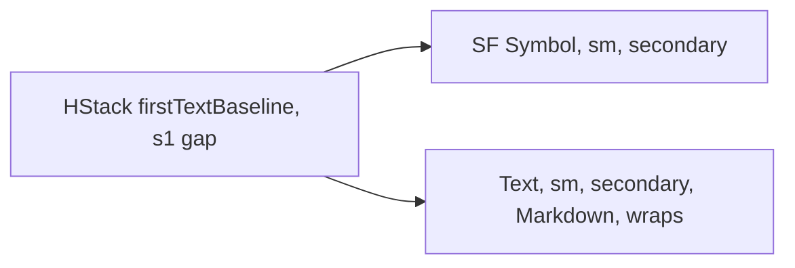

# HintRow

**File:** [`apps/native/WolfWave/Views/Shared/HintRow.swift`](../../apps/native/WolfWave/Views/Shared/HintRow.swift)

## Purpose
A compact footnote hint: a small secondary SF Symbol followed by secondary text, with no background or tint. Use for an inline tip directly under a control (e.g. "Cooldowns don't apply to you or your mods."). For a note that needs a colored wash, use `CalloutBanner` instead.

## API
```swift
HintRow("Cooldowns don't apply to you or your mods.")
HintRow("Nothing is uploaded. Everything stays on this Mac.", systemImage: "lock.fill")
```

| Param | Type | Default | Notes |
|---|---|---|---|
| `text` | `String` | (required) | First positional arg. Parsed as Markdown so inline `**bold**` renders. Wraps via `.fixedSize(vertical: true)`. |
| `systemImage` | `String` | `"info.circle.fill"` | Leading SF Symbol, rendered small and secondary. |

## Tokens used
- `DSFont.Size.sm` (11): icon and text
- `DSSpace.s1` (4): icon/text gap

## Anatomy


## Accessibility
- `.accessibilityElement(children: .combine)` reads the icon and text as one element; the icon is `.accessibilityHidden`.
- All-secondary styling is intentional: this is a low-emphasis footnote, not a status signal. Don't use it for state that needs attention (reach for `CalloutBanner`).

## Do / Don't
- ✅ Use for a one-line tip directly under the control it explains.
- ✅ Keep it to a single short sentence.
- ❌ Don't add a background or tint. If it needs emphasis, it is a `CalloutBanner`.
- ❌ Don't stack several HintRows. Fold the guidance into one card sub-section instead.

## Example
```swift
VStack(alignment: .leading, spacing: DSSpace.s2) {
    // ...command toggles...
}
.cardStyleUnpadded()

HintRow("Cooldowns don't apply to you or your mods.")
```
