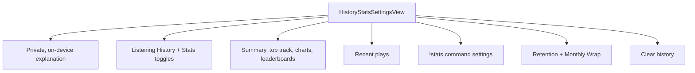

# HistoryStatsSettingsView

**File:** [`apps/native/WolfWave/Views/HistoryStats/HistoryStatsSettingsView.swift`](../../apps/native/WolfWave/Views/HistoryStats/HistoryStatsSettingsView.swift)

## Purpose

Owns the complete History & Stats settings pane: opt-in tracking, summary cards, recent plays, charts, the `!stats` command, retention, Monthly Wrap, and destructive history controls.

## API

```swift
HistoryStatsSettingsView(openTwitchSettings: () -> Void = {})
```

| Param | Type | Notes |
|---|---|---|
| `openTwitchSettings` | `() -> Void` | Opens Twitch settings when the `!stats` command is blocked by authentication or connection state. |

## Tokens used

- `DSFont.Size.body` and the shared heading modifiers provide the pane's type hierarchy.
- `DSSpace` values flow through shared components; pane-level spacing and padding use `AppConstants.SettingsUI`.
- `DSColor.success`, `.warning`, `.error`, `.info`, and `.neutral` carry status state through shared chips and callouts.
- `DSDimension.HistoryStats` sizes the charts through `WeekChartCard` and `HourChartCard`.

## Anatomy



## Accessibility

- Toggle rows provide explicit labels and stable accessibility identifiers.
- Loading data keeps the dashboard footprint with skeleton placeholders instead of shifting focus targets.
- Destructive clearing requires a confirmation alert and exposes a dedicated confirm-button identifier.
- The layout collapses through `ResponsiveRow`, preserving the same top-to-bottom reading order at narrow widths.

## Do / Don't

- ✅ Keep History as the parent capability; turning it off must also disable dependent Stats features.
- ✅ Route reusable rows, cards, banners, and charts through the shared components already used here.
- ❌ Don't read or write listening-history state from a second settings surface; this pane owns the user-facing controls.
- ❌ Don't bypass the Twitch readiness gate for `!stats`; enabled UI without a working chat connection is misleading.

## Example

```swift
HistoryStatsSettingsView {
    selectedSection = .twitch
}
```
