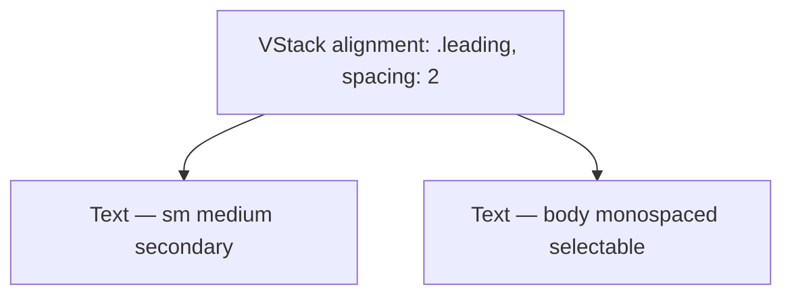

# InfoRow

**File:** [`apps/native/wolfwave/Views/Shared/InfoRow.swift`](../../apps/native/wolfwave/Views/Shared/InfoRow.swift)

## Purpose
Label + value row for read-only technical info (URLs, ports, versions). Value is selectable for copy/paste.

## API
```swift
InfoRow(label: "Local Address", value: "ws://localhost:8765")
InfoRow(label: "Version", value: "1.2.0", isMonospaced: false)
```

| Param | Type | Default | Notes |
|---|---|---|---|
| `label` | `String` | — | Short, sentence-case heading. |
| `value` | `String` | — | Read-only value. Text-selection enabled. |
| `isMonospaced` | `Bool` | `true` | Monospace for technical values; off for human-readable. |

## Tokens used
- Label: `DSFont.Size.sm` (11) / `DSFont.Weight.medium`, `.secondary` foreground
- Value: `DSFont.Size.body` (12), monospaced or default
- Internal spacing: `DSSpace.1` (2 between label and value — tightest scale step)

## Anatomy


## Accessibility
- Label and value are read in order by VoiceOver.
- Text selection (`.textSelection(.enabled)`) — VoiceOver users can use Read All; pointer users can copy.

## Do / Don't
- ✅ Use inside cards (`cardStyle`) for grouped info.
- ✅ Pair with `CopyButton` when the value is long.
- ❌ Don't use for editable fields — that's `ToggleSettingRow` / `TextField`.

## Example
```swift
VStack(alignment: .leading, spacing: DSSpace.s2) {
  InfoRow(label: "WebSocket URL", value: "ws://localhost:\(port)")
  InfoRow(label: "Widget URL",    value: "http://localhost:\(widgetPort)/")
}
.cardStyle()
```
