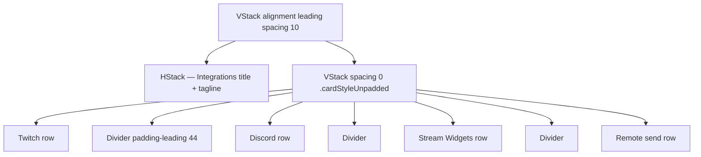
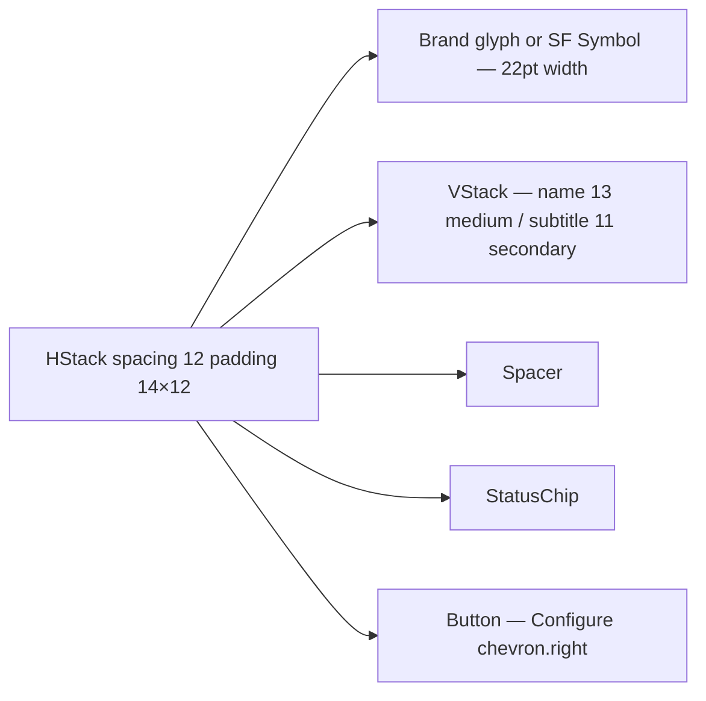

# IntegrationDashboardView

**File:** [`apps/native/WolfWave/Views/Shared/IntegrationDashboardView.swift`](../../apps/native/WolfWave/Views/Shared/IntegrationDashboardView.swift)

## Purpose
Compact "where is WolfWave broadcasting right now" dashboard. One row per integration (Twitch chat, Discord profile, Stream Widgets, Remote send) with brand glyph, plain-language status subtitle, `StatusChip`, and a "Configure ›" route into the relevant settings pane.

## API
```swift
IntegrationDashboardView(
    twitchConnected: true,
    twitchChannel: "nightowlstream",
    twitchViewerCount: 12,
    discordConnected: true,
    widgetRunning: true,
    widgetURL: "http://localhost:8766",
    remoteSendingEnabled: false,
    configure: { section in /* route */ }
)
```

| Param | Type | Notes |
|---|---|---|
| `twitchConnected` | `Bool` | Drives Live/Off chip + subtitle. |
| `twitchChannel` | `String?` | Rendered as `@channel` when connected. |
| `twitchViewerCount` | `Int?` | Appended when > 0. |
| `discordConnected` | `Bool` | "Showing now" / "Off". |
| `widgetRunning` | `Bool` | OBS widget HTTP server status. |
| `widgetURL` | `String?` | Shown inline in the subtitle for copy/paste. |
| `remoteSendingEnabled` | `Bool` | Optional remote forwarding (Advanced). |
| `permissionPaused` | `Bool` | Overrides every chip with `"Paused"` (orange) when Music permission missing. |
| `configure` | `(Section) -> Void` | Routes to `.twitch / .discord / .obs / .advanced`. |

## Tokens used
- `DSColor.partnerTwitch` (`#9146FF`) / `DSColor.partnerDiscord` (`#5865F2`) — brand glyph tints (via `AppConstants.Brand`)
- `DSColor.success` (`#34C759`) — Live / Showing now / Ready for OBS
- `DSColor.warning` (`#FF9F0A`) — Paused
- `DSFont.Size.base` (13) `.medium` — row name
- `DSFont.Size.sm` (11) `.secondary` — row subtitle (max 2 lines)
- `DSFont.Size.body` (12) — "Configure" button + section subhead
- `DSSpace.s3` (12) — row horizontal padding
- `DSSpace.s4` (12) — row vertical padding
- `DSDimension.Settings.cardCornerRadius` (14) via `.cardStyleUnpadded()`
- Composes `StatusChip` — see [status-chip.md](status-chip.md)

## Anatomy


Each row:


## Accessibility
- Each "Configure" button has explicit `accessibilityLabel("Configure <name>")` — VoiceOver reads the target integration.
- Chip animation on status change uses `.easeInOut(duration: 0.2)` — short enough not to fight the rest of the row.
- Brand-asset existence is cached (`brandIconExistsCache`) so asset-catalog lookups happen once per icon.

## Do / Don't
- ✅ Place once on the General tab below `NowPlayingHeroCard`.
- ✅ Always pass `permissionPaused` — without it, chips show "Live" while audio tracking is actually frozen.
- ❌ Don't reuse for per-integration settings panes — those have their own `SectionHeaderWithStatus`.
- ❌ Don't duplicate rows — the four broadcast surfaces are fixed; new integrations need their own row + chip wiring.

## Example
```swift
IntegrationDashboardView(
    twitchConnected: twitchVM.isConnected,
    twitchChannel: twitchVM.channelName,
    twitchViewerCount: twitchVM.viewerCount,
    discordConnected: discordEnabled && discordService.isConnected,
    widgetRunning: webSocketRunning,
    widgetURL: widgetHTTPURL,
    remoteSendingEnabled: remoteForwardingEnabled,
    permissionPaused: !musicPermissionGranted,
    configure: { section in router.show(section) }
)
```
