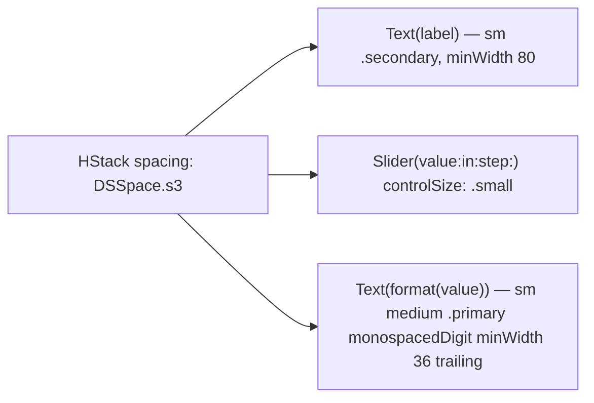

# LabeledSlider

Slider row with a leading label and a trailing live value readout.

## Purpose

Bare `Slider` controls have no numeric indicator next to the thumb — the user has to guess "what does the current value mean?". Used for command cooldown rows (Everyone / Per person) across the Twitch Bot Commands and Song Request panes via [`CommandSettingRow`](command-setting-row.md), and in History's `!stats` card — both lay the Everyone / Per-person pair out two-up via [`CooldownSliderPair`](cooldown-slider-pair.md) — so the user can see "15s" change as they drag.

## API

```swift
LabeledSlider<V: BinaryFloatingPoint>(
    label: String,
    value: Binding<V>,
    range: ClosedRange<V>,
    step: V.Stride = 1,
    format: (V) -> String = { String(Int($0)) },
    accessibilityIdentifier: String? = nil
) where V.Stride: BinaryFloatingPoint
```

## Tokens used

| Token | Where |
|---|---|
| `DSSpace.s3` | HStack spacing |
| `DSFont.Size.sm` (11) | label + value |

## Anatomy



## Accessibility

- Combined element; label = user-supplied label, value = formatter output.
- Identifier defaults to `"labeledSlider.\(label)"`.
- `monospacedDigit()` keeps readout width stable while the user drags.

## Do / Don't

- ✅ Provide a `format` closure that includes units ("15s", "120ms", "85%").
- ✅ Use sentence-case labels ("Everyone", "Per person").
- ❌ Don't omit units in the formatter — bare numbers next to a slider are ambiguous.
- ❌ Don't nest two `LabeledSlider`s inside their own cards — group them in one card with `Divider`s.

## Example

```swift
LabeledSlider(
    label: "Everyone",
    value: $songGlobalCooldown,
    range: 5...120,
    format: { "\(Int($0))s" },
    accessibilityIdentifier: "songCommandGlobalCooldown"
)
```
