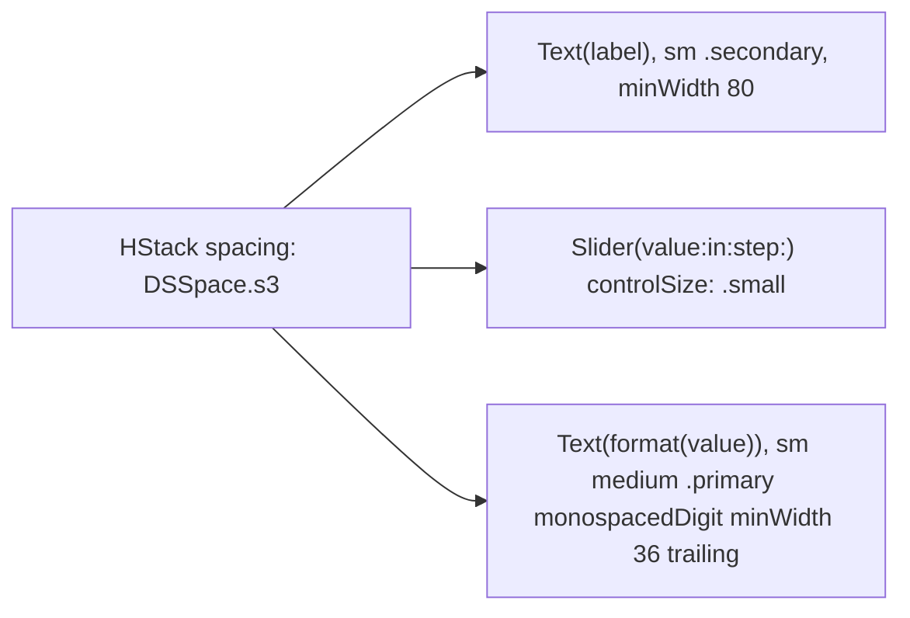

# LabeledSlider

**File:** [`apps/native/WolfWave/Views/Shared/LabeledSlider.swift`](../../apps/native/WolfWave/Views/Shared/LabeledSlider.swift)

Slider row with a leading label and a trailing live value readout.

## Purpose

Bare `Slider` controls have no numeric indicator next to the thumb, so the user has to guess "what does the current value mean?". Used for command cooldown rows (Everyone / Per person) across the Twitch Bot Commands and Song Request panes via [`CommandSettingRow`](command-setting-row.md), and in History's `!stats` card. Both lay the Everyone / Per-person pair out two-up via [`CooldownSliderPair`](cooldown-slider-pair.md) so the user can see "15s" change as they drag.

## API

```swift
LabeledSlider<V: BinaryFloatingPoint>(
    label: String,
    value: Binding<V>,
    range: ClosedRange<V>,
    step: V.Stride = 1,
    format: (V) -> String = { String(Int($0)) },
    accessibilityIdentifier: String? = nil
) where V.Stride: BinaryFloatingPoint
```

## Value sanitizing

`LabeledSlider` clamps the value it renders. `displayValue(_:in:)` folds anything
outside `range` back to the nearest bound and turns a non-finite value into
`range.lowerBound`. The `Slider` and the readout both use that clamped value, and
`format` receives it rather than the raw binding.

This is a crash guard, not a cosmetic one. Every caller binds an `@AppStorage`
double, so the stored value is whatever a hand-edited plist, `defaults write`, or
an older build left behind, and the default formatter is `Int($0)` — which traps
outright on NaN or a value past `Int.max`. Clamping here covers every call site,
including the ones passing their own `"\(Int($0))s"` closure.

The binding is only sanitized on the way *out*. Writes pass through untouched: a
slider can only produce an in-range value, and repairing stored state as a side
effect of drawing would fight whatever wrote it.

## Tokens used

| Token | Where |
|---|---|
| `DSSpace.s3` | HStack spacing |
| `DSFont.Size.sm` (11) | label + value |

## Anatomy


```mermaid
flowchart LR
    Row[HStack spacing: DSSpace.s3]
    Row --> Label["Text(label), sm .secondary, minWidth 80"]
    Row --> Slider["Slider(value:in:step:) controlSize: .small"]
    Row --> Value["Text(format(value)), sm medium .primary monospacedDigit minWidth 36 trailing"]
```

## Accessibility

- Combined element; label = user-supplied label, value = formatter output.
- Identifier defaults to `"labeledSlider.\(label)"`.
- `monospacedDigit()` keeps readout width stable while the user drags.

## Do / Don't

- ✅ Provide a `format` closure that includes units ("15s", "120ms", "85%").
- ✅ Use sentence-case labels ("Everyone", "Per person").
- ❌ Don't omit units in the formatter. Bare numbers next to a slider are ambiguous.
- ❌ Don't nest two `LabeledSlider`s inside their own cards. Group them in one card with `Divider`s.
- ❌ Don't hand-roll a `Slider` bound straight to `@AppStorage` to avoid this component. That is the shape that crashed the settings window; use `LabeledSlider`, or [`Binding.clamped(to:fallback:)`](binding-sanitized.md) if the layout genuinely differs.

## Example

```swift
LabeledSlider(
    label: "Everyone",
    value: $songGlobalCooldown,
    range: 5...120,
    format: { "\(Int($0))s" },
    accessibilityIdentifier: "songCommandGlobalCooldown"
)
```
