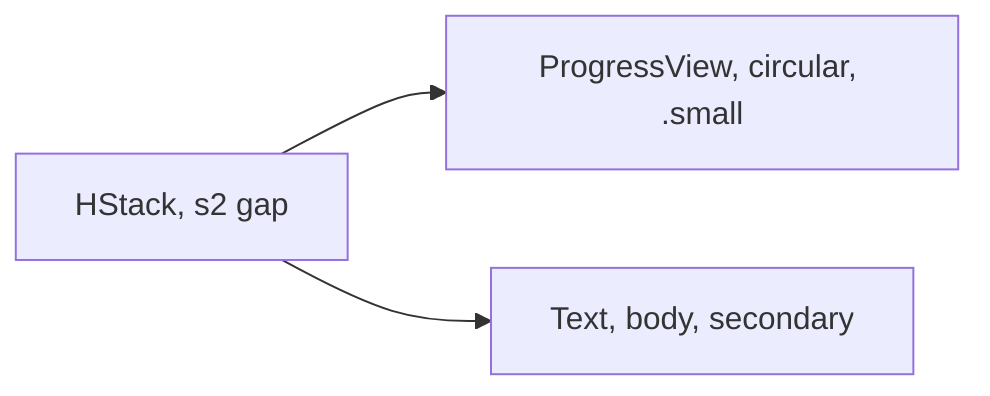

# LoadingRow

**File:** [`apps/native/WolfWave/Views/Shared/LoadingRow.swift`](../../apps/native/WolfWave/Views/Shared/LoadingRow.swift)

## Purpose
Inline row pairing a small circular `ProgressView` with a secondary label. Used for short-lived async waits inside settings panes (connection tests, onboarding handshake, "waiting for service" lines).

## API
```swift
LoadingRow(text: "Waiting for Twitch…")
```

| Param | Type | Notes |
|---|---|---|
| `text` | `String` | Wait-state copy. Keep short; this is a row, not a card. |

## Tokens used
- `DSFont.Size.body` (13)
- `DSSpace.s2` (8): gap between spinner and text

## Anatomy


## Accessibility
- `.accessibilityElement(children: .combine)` + `.accessibilityLabel(text)` collapses spinner + text into a single VoiceOver element, so assistive tech reads the wait state once.
- Dynamic Type: text scales with the system size; the spinner uses `.controlSize(.small)` which adapts as well.

## Do / Don't
- ✅ Use inline inside a card body or button label.
- ✅ Keep the wait copy short and specific ("Waiting for Twitch…", "Testing…").
- ❌ Don't use for first-paint redaction; reach for `.skeleton(_:)` instead.
- ❌ Don't use to replace a button's label while it loads. Keep the spinner inside the `Button { … }` label.
- ❌ Don't pair with `.controlSize(.large)`; sizes are intentionally fixed for visual rhythm.

## Example
```swift
LoadingRow(text: "Testing…")
```
