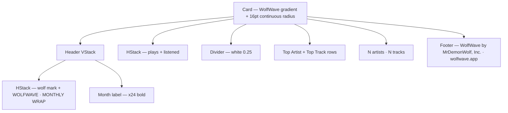

# MonthlyWrapCard

**File:** [`apps/native/WolfWave/Views/HistoryStats/MonthlyWrapView.swift`](../../apps/native/WolfWave/Views/HistoryStats/MonthlyWrapView.swift)

## Purpose
Shareable "wrapped"-style summary card for a single calendar month — wordmark + wolf mark lockup, headline stats (plays, listening time, top artist, top track), and an attribution footer. Rendered both in the sheet UI and exported to PNG via `ImageRenderer(scale: 2)`.

## API
```swift
MonthlyWrapCard(data: wrap)
    .frame(width: 380)
```

| Param | Type | Notes |
|---|---|---|
| `data` | `MonthlyWrapData` | Aggregated month summary. When `data.hasData == false` the card renders the empty state. |

Card width is owner-controlled — production callers use `380`. Height grows to content.

## Tokens used
- Background gradient: `AppConstants.Brand.wolfwaveGradientStart` → `wolfwaveGradientEnd` (`DSColor.partnerWolfwaveGradientStart` / `End`, `#0A2540` → `#2563EB`)
- Type: `DSFont.Size.x9` (eyebrow + row caption), `DSFont.Size.x15` (row value), `DSFont.Size.x24` (month label), `DSFont.Size.x28` (stat values), `DSFont.Size.sm` (stat subtitle), `DSFont.Size.base` (empty state), `DSFont.Size.xs` (footer)
- Spacing: `DSSpace.s0` (lockup), `DSSpace.s2` (mark gap + footer top), `DSSpace.s4` (empty state vertical pad), `DSSpace.s5` (outer stack), `DSSpace.s7` (card padding), `DSSpace.s8` (stat blocks)
- Wolf mark dimension: `DSSpace.s6` (16) — `TrayIcon` rendered as `.template` over white
- Foreground: pure white at `1.0` (primary), `0.7` (eyebrow + stat subtitle), `0.6` (row caption), `0.55` (footer), `0.25` (divider)
- Corner radius: `16` (continuous) — legacy literal tracked in `lint-allowlist.txt`

## Anatomy


When `!data.hasData`, the Stats / Rule / Rows / Diversity nodes collapse to a single `"No plays recorded in <month>."` line.

## Accessibility
- Decorative-only graphic — text content carries every datum (counts, top artist, top track) so a screen reader synthesizing the card by reading children gets the full summary.
- Foreground/background contrast: white text on `#0A2540` start stop measures ≥ 12:1 (AAA). At the brightest `#2563EB` end stop it measures ≥ 4.7:1 (AA Large for the `x24` month label and `x28` stat values; AA Normal for the `sm` subtitles). Avoid lowering the gradient end stop's luminance — it's at the contrast floor for the smaller `xs` footer text already softened to `opacity 0.55`.
- Wolf mark rendered with `renderingMode(.template)` — inherits the white foreground; no color-only semantics.

## Do / Don't
- ✅ Pass a `MonthlyWrapData` produced by `MonthlyWrap.data(from:month:calendar:)` — the card relies on its `monthLabel`, `hasData`, and counter fields being internally consistent.
- ✅ Frame to `380` for share parity — that's the production size the PNG export ships at.
- ❌ Don't swap the gradient to a partner brand (Apple Music, Discord, Twitch) — this card represents WolfWave, not the playback source.
- ❌ Don't hand-edit the generated token files to retune the gradient — edit `design-system/tokens.json` and regenerate.
- ❌ Don't remove the attribution footer — re-shared screenshots rely on it for provenance.

## Example
```swift
let wrap = service.monthlyWrap(for: Date())
MonthlyWrapCard(data: wrap)
    .frame(width: 380)
```

Export path (see `MonthlyWrapView.exportImage()`):
```swift
let renderer = ImageRenderer(content:
    MonthlyWrapCard(data: wrap)
        .frame(width: 380)
        .padding(DSSpace.s7)
        .background(Color(nsColor: .windowBackgroundColor))
)
renderer.scale = 2
```
