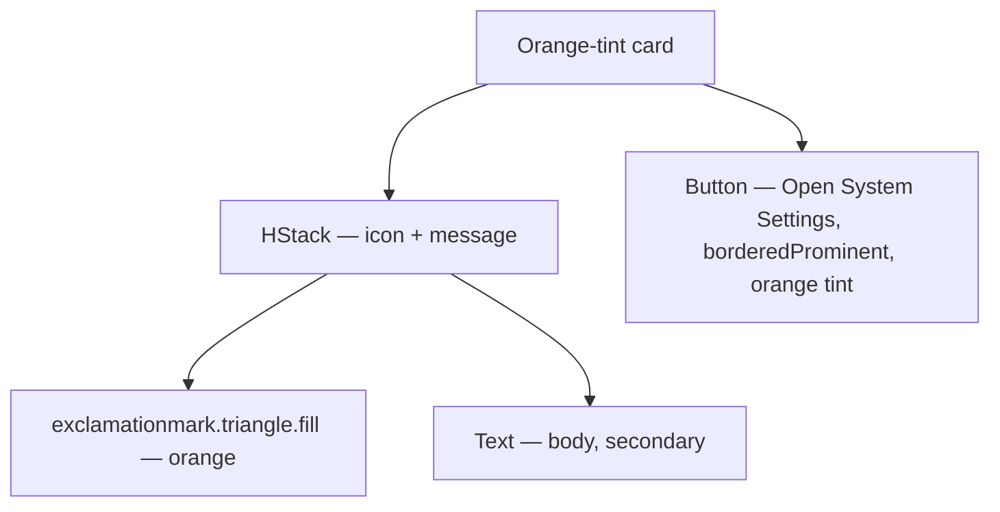

# MusicPermissionBanner

**File:** [`apps/native/wolfwave/Views/Shared/MusicPermissionBanner.swift`](../../apps/native/wolfwave/Views/Shared/MusicPermissionBanner.swift)

## Purpose
Orange-tinted warning card shown when WolfWave is missing the Apple Music access it needs for a feature. Pairs a clear explanation with an "Open System Settings" call-to-action that deep-links to the Automation pane via `MusicPermissionChecker.openAutomationSettings()`.

Currently covers **Apple Events automation** permission (used by `AppleMusicSource` for now-playing reads, listening history recording, etc.). The MusicKit `MusicAuthorization` flow used by Song Requests is rendered by `SongRequestMusicAuthCard` inside `SongRequestSettingsView` — migrating that to this banner is tracked as future cleanup.

## API
```swift
MusicPermissionBanner(
    message: "WolfWave needs Apple Music automation access to record what you play. Enable it in System Settings → Privacy & Security → Automation."
)
```

| Param | Type | Notes |
|---|---|---|
| `message` | `String` | User-facing explanation of what the missing permission blocks. Keep ADHD-friendly: short, punchy, jargon-free. |
| `onOpenSettings` | `() -> Void` | Optional. Defaults to `MusicPermissionChecker.openAutomationSettings`. Override only for tests or non-Automation scopes. |

The banner does **not** self-gate on permission state — callers wrap it in `if state == .denied { ... }`. This keeps the component dumb and the caller in control of when to render.

## Tokens used
- `DSFont.Size.body` (12) for the message
- `DSSpace.s4` (12) between message row and button, `DSSpace.s2` (8) icon-to-text gap
- `AppConstants.SettingsUI.cardPadding` (16) outer padding
- `AppConstants.SettingsUI.cardCornerRadius` (14) rounded corners
- Tint: `.orange` (semantic warning — matches `SongRequestMusicAuthCard` precedent)
- Background: `.orange.opacity(0.1)`

## Anatomy


## Accessibility
- Combined accessibility element. VoiceOver reads `"Apple Music permission required. <message>"`.
- Icon is decorative (`accessibilityHidden(true)`).
- Button has identifier `musicPermissionOpenSettings` for UI tests.
- Color (orange) is **not the sole signal** — the icon glyph and message convey the warning independently.

## Do / Don't
- ✅ Render conditionally above the gated controls so the user can act before flipping a toggle that won't work.
- ✅ When using this banner, also disable the dependent toggles (e.g. `isDisabled: musicPermission == .denied`).
- ❌ Don't render unconditionally — an orange card with no problem to solve is noise.
- ❌ Don't reuse for non-Apple-Music permissions; the copy and deep-link target are specific.
- ❌ Don't customize the tint or background away from orange — keep warning visual language consistent across the app.

## Example
```swift
if musicPermission == .denied {
    MusicPermissionBanner(
        message: "WolfWave needs Apple Music automation access to record what you play. Enable it in System Settings → Privacy & Security → Automation."
    )
}
```
