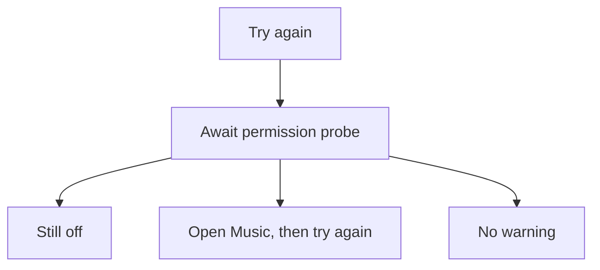

# MusicPermissionRecheckButton

**File:** [`apps/native/WolfWave/Views/Shared/MusicPermissionRecheckButton.swift`](../../apps/native/WolfWave/Views/Shared/MusicPermissionRecheckButton.swift)

## Purpose

Shared Automation permission recheck for the denied banner and instruction sheet. Uses AsyncActionButton to await the probe, prevent duplicate clicks, and show a spinner.

## API

```swift
MusicPermissionRecheckButton(onTryAgain: refreshPermission)
```

| Param | Type | Notes |
|---|---|---|
| `onTryAgain` | `() async -> MusicPermissionState` | Returns the actual probe result and updates the owner's permission state. |

## Tokens used

- `DSSpace.s2` separates the button and result.
- `DSFont.Size.sm` sizes result text; `.secondary` supplies semantic contrast.
- AsyncActionButton owns button metrics and motion behavior.

## Anatomy



## Accessibility

The button retains its spoken title while busy, and its hint describes the permission probe. Feedback is visible text and does not rely on color.

## Do / Don't

- Do return the actual permission result; update the parent from the same probe.
- Don't infer denial from a timer or from whether a sheet is still visible.

## Example

```swift
MusicPermissionRecheckButton(onTryAgain: { await MusicPermissionChecker.recheck() })
```
