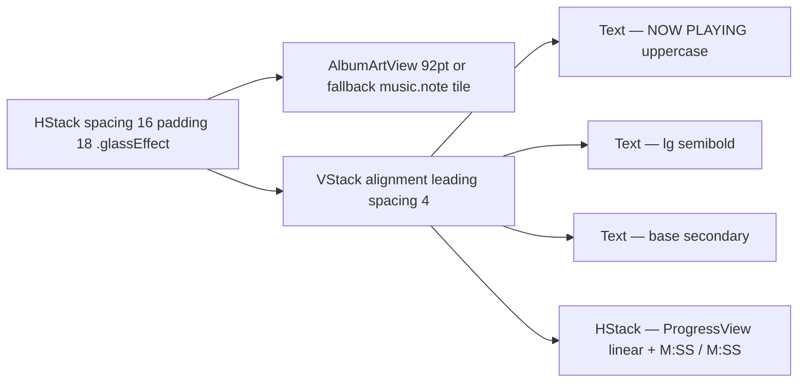

# NowPlayingHeroCard

**File:** [`apps/native/wolfwave/Views/Shared/NowPlayingHeroCard.swift`](../../apps/native/wolfwave/Views/Shared/NowPlayingHeroCard.swift)

## Purpose
The "Now Playing" hero on the General tab — 92pt album art, title/artist/album, and a scrubber. Composes `AlbumArtView` for the artwork tile and the Liquid Glass `.glassEffect()` for the card background.

## API
```swift
NowPlayingHeroCard(
    track: "Anti-Hero",
    artist: "Taylor Swift",
    album: "Midnights",
    elapsed: 68,
    duration: 201
)
```

| Param | Type | Notes |
|---|---|---|
| `track` | `String?` | Nil renders the empty state ("Nothing playing right now" or "Sync Music is off"). |
| `artist` | `String?` | Combined with album into a single em-dash separated subtitle. |
| `album` | `String?` | Same — either, both, or neither can be nil. |
| `artwork` | `NSImage?` | When nil the inner `AlbumArtView` falls back to a hashed gradient. |
| `elapsed` | `TimeInterval` | Seconds. Shown as `M:SS` in monospaced caption. |
| `duration` | `TimeInterval` | Seconds. Scrubber + total time hidden when 0. |
| `trackingEnabled` | `Bool` | Drives the empty-state copy when `track == nil`. |

## Tokens used
- `DSDimension.Settings.cardCornerRadius` (14) — card corner radius via `.glassEffect(.regular, in: .rect(...))`
- `DSFont.Size.sm` (11) `.semibold` `.tertiary` `.uppercase` `tracking(0.6)` — "Now playing" eyebrow label
- `DSFont.Size.lg` (17→18) `.semibold` — track title
- `DSFont.Size.base` (13) `.secondary` — artist — album subtitle
- `DSFont.Size.sm` (11) monospaced — scrubber timestamps
- `DSSpace.s6` (16) — card outer padding (rendered as 18 for hero weight)
- `DSSpace.s6` (16) — artwork ↔ text gap
- Composes `AlbumArtView` (92pt) — see [album-art-view.md](album-art-view.md)

## Anatomy


## Accessibility
- `accessibilityElement(children: .combine)` — VoiceOver reads the whole card.
- Compound label: `"Now playing: <track>, by <artist>, on <album>"` — falls back to permission-state copy when no track.
- `monospacedDigit()` keeps timestamps stable as the seconds tick.

## Do / Don't
- ✅ Place at the top of the General tab, single instance per pane.
- ✅ Pass nil `track` rather than empty strings so the empty state copy renders.
- ❌ Don't use elsewhere as a "song chip" — use a `Compact` widget layout or a custom row instead.
- ❌ Don't override the card padding/radius — they're tuned to the Liquid Glass material.

## Example
```swift
NowPlayingHeroCard(
    track: nowPlaying?.track,
    artist: nowPlaying?.artist,
    album: nowPlaying?.album,
    artwork: nowPlaying?.artwork,
    elapsed: elapsed,
    duration: nowPlaying?.duration ?? 0,
    trackingEnabled: trackingEnabled
)
```
