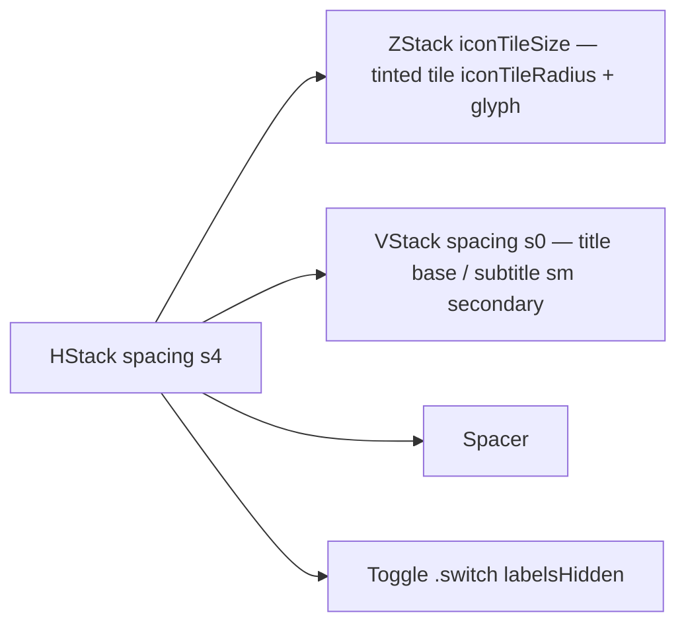

# OnboardingToggleCard

**File:** [`apps/native/WolfWave/Views/Onboarding/Components/OnboardingToggleCard.swift`](../../apps/native/WolfWave/Views/Onboarding/Components/OnboardingToggleCard.swift)

## Purpose
An onboarding-styled toggle row: a tinted SF Symbol tile, a title + subtitle, and a trailing switch inside a bordered card. Shared by the Preferences and Notifications onboarding steps, which previously kept byte-identical private copies of the layout.

## API
```swift
OnboardingToggleCard(
    icon: "bell.badge",
    iconColor: .orange,
    title: "Song change alerts",
    subtitle: "A banner when the track changes.",
    isOn: $songChangeEnabled,
    accessibilityLabel: "Song change alerts",
    accessibilityIdentifier: "onboarding.toggle.songChange"
)
```

| Param | Type | Notes |
|---|---|---|
| `icon` | `String` | SF Symbol shown in the tinted leading tile. |
| `iconColor` | `Color` | Tile tint (15% fill + glyph). |
| `title` | `String` | Semibold lead line. |
| `subtitle` | `String` | One-line muted explanation; wraps if needed. |
| `isOn` | `Binding<Bool>` | Backing toggle state. |
| `accessibilityLabel` | `String` | Spoken name for the switch. |
| `accessibilityIdentifier` | `String` | UI-test handle for the switch. |

## Tokens used
- `DSSpace.s4` (12) — outer padding + row spacing
- `DSSpace.s0` (2) — title ↔ subtitle gap
- `DSFont.Size.base` (13) — title; icon glyph
- `DSFont.Size.sm` (11) — subtitle
- `DSRadius.lg2` (12) — card corner
- `AppConstants.OnboardingUI.iconTileSize` (28) — icon tile side
- `AppConstants.OnboardingUI.iconTileRadius` (7) — icon tile corner (mirrors the brand tile's 25% ratio)

## Anatomy


## Accessibility
- The switch carries the caller's `accessibilityLabel` + `accessibilityIdentifier`.
- The icon tile is decorative; the title/subtitle convey meaning.

## Do / Don't
- ✅ Use for the boolean opt-ins on the Preferences and Notifications onboarding steps.
- ❌ Don't use in settings panes — those use `ToggleSettingRow` (the settings-language equivalent).

## Example
```swift
OnboardingToggleCard(
    icon: "power",
    iconColor: .blue,
    title: "Launch at login",
    subtitle: "Start WolfWave when you sign in.",
    isOn: $launchAtLogin,
    accessibilityLabel: "Launch at login",
    accessibilityIdentifier: "onboarding.toggle.launch"
)
```
