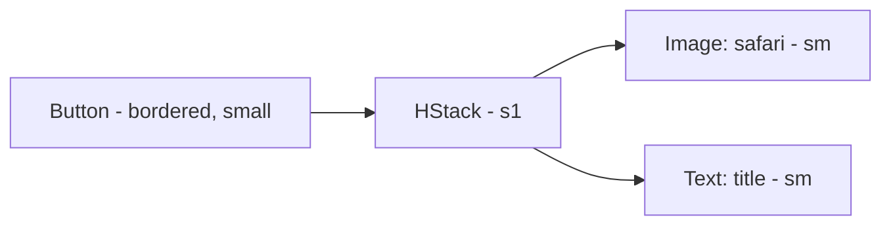

# OpenInBrowserButton

**File:** [`apps/native/WolfWave/Views/Shared/OpenInBrowserButton.swift`](../../apps/native/WolfWave/Views/Shared/OpenInBrowserButton.swift)

## Purpose
Small bordered "Open" button that launches a URL string in the default browser via `ExternalLink.open`. Replaces the hand-rolled open buttons in Stream Widgets settings so the `safari` glyph, sizing, disabled handling, and the `URL(string:)` guard live in one place.

## API
```swift
OpenInBrowserButton(
    urlString: widgetURL,
    isDisabled: !websocketEnabled || streamerMode,
    accessibilityLabel: "Open widget in browser",
    accessibilityHint: "Opens the widget in your default browser",
    accessibilityIdentifier: "openWidgetURLButton"
)
```

| Param | Type | Notes |
|---|---|---|
| `urlString` | `String` | URL to open. Invalid strings are dropped silently by `ExternalLink.open`. |
| `title` | `String` | Button label. Defaults to `"Open"`. |
| `isDisabled` | `Bool` | Greys out + blocks the tap. Default `false`. Gate on Streamer Mode + the owning feature toggle. |
| `accessibilityLabel` | `String` | VoiceOver label (required). |
| `accessibilityHint` | `String` | VoiceOver hint. Default `""` (omit when no hint). |
| `accessibilityIdentifier` | `String` | UI-test identifier. Default `""`. |

## Tokens used
- `DSFont.Size.sm` (11) - `safari` glyph + title
- `DSSpace.s1` (4) - gap between glyph and title
- `.buttonStyle(.bordered)` + `.controlSize(.small)` - matches `CopyButton` / `DSIconButton` height baseline

## Anatomy


## Accessibility
- Requires an explicit `accessibilityLabel`; the glyph alone is not descriptive.
- `accessibilityHint` is optional - supply it only when the destination is non-obvious.
- Disabled state is driven by `isDisabled`; pair it with the same gate used by the neighboring `CopyButton` so the row's actions enable/disable together.

## Do / Don't
- ✅ Pair with `CopyButton` in a copy-link row (see `CopyableURLRow`).
- ✅ Disable alongside Streamer Mode so a masked URL can't be opened.
- ❌ Don't hand-roll `Button { ExternalLink.open(...) }` with a `safari` glyph - use this so sizing and the URL guard stay consistent.
- ❌ Don't pass a pre-masked URL string - open needs the real URL.

## Example
```swift
OpenInBrowserButton(
    urlString: networkWidget,
    isDisabled: !websocketEnabled || !widgetHTTPEnabled || streamerMode,
    accessibilityLabel: "Open network widget in browser",
    accessibilityIdentifier: "openNetworkWidgetURLButton"
)
```
