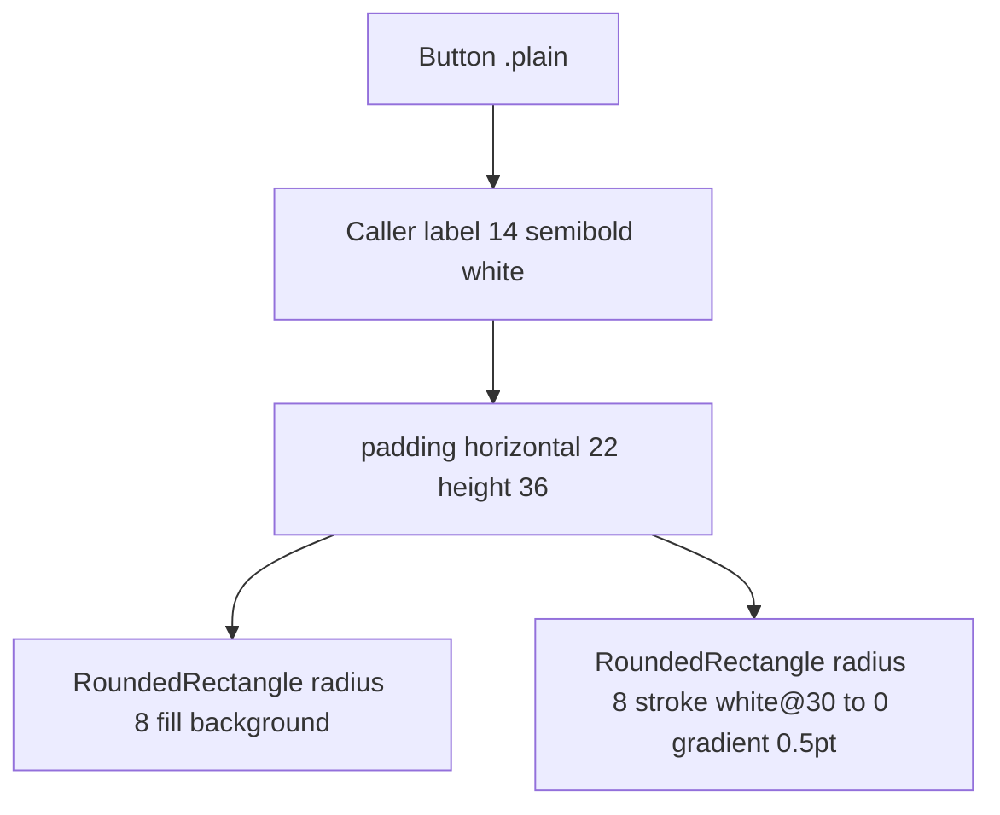

# PillButton

**File:** [`apps/native/WolfWave/Views/Onboarding/Components/PillButton.swift`](../../apps/native/WolfWave/Views/Onboarding/Components/PillButton.swift)

## Purpose
Onboarding primary CTA: pill-shaped button with a brand-coloured fill and an inner light highlight. Flat by design, no outer glow halo. Used for "Sign in with Twitch", "Grant Apple Music Access", "Connect Discord", etc.

## API
```swift
PillButton(
    background: AnyShapeStyle(LinearGradient(colors: [DSColor.partnerTwitch, .purple], startPoint: .top, endPoint: .bottom)),
    action: { startTwitchAuth() }
) {
    HStack(spacing: 8) {
        TwitchGlitchShape().fill(style: FillStyle(eoFill: true)).frame(width: 14, height: 14)
        Text("Sign in with Twitch")
    }
}
```

| Param | Type | Notes |
|---|---|---|
| `background` | `AnyShapeStyle` | Brand fill: solid `Color` or `LinearGradient` wrapped in `AnyShapeStyle`. |
| `disabled` | `Bool` | Dims to `opacity 0.65` and locks the button. |
| `action` | `() -> Void` | Tap handler. |
| `label` | `() -> Label` | `@ViewBuilder`, icon + text typically. |

## Tokens used
- `DSDimension.Onboarding.primaryButtonRadius` (8): rounded rect radius
- `DSDimension.Onboarding.primaryButtonHeight` (32 → rendered 36 for pill weight): fixed height
- `DSFont.Size.md` (14) `.semibold` `.white`: label
- `DSSpace.s7` (20→22): horizontal padding
- Hairline overlay: `white@30%` → `white@0%` top-to-bottom, 0.5pt stroke

## Anatomy


## Accessibility
- Inherits label from the supplied `@ViewBuilder` content; pass meaningful `Text` so VoiceOver gets the verb.
- `.pointerCursor()`: flips to the system pointing cursor on hover.
- Disabled state dims visually *and* sets `.disabled(true)` so VoiceOver announces it.

## Do / Don't
- ✅ Reserve for primary integration CTAs in onboarding. One per step.
- ✅ Keep it flat. The fill plus the hairline highlight carry the affordance, no glow needed.
- ❌ Don't use outside onboarding. Settings panes use `.borderedProminent` for primary actions.
- ❌ Don't omit the brand glyph for integration buttons; the icon makes the destination unmistakable.

## Example
```swift
PillButton(
    background: AnyShapeStyle(DSColor.partnerDiscord),
    action: connectDiscord
) {
    HStack(spacing: 8) {
        Image("DiscordLogo").renderingMode(.template).resizable().frame(width: 14, height: 14)
        Text("Connect Discord")
    }
}
```
