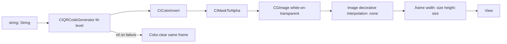

# QRCodeImage

**File:** [`apps/native/WolfWave/Views/Shared/QRCodeImage.swift`](../../apps/native/WolfWave/Views/Shared/QRCodeImage.swift)

## Purpose

Renders a string (typically a URL) as a crisp, square QR code bitmap using CoreImage. The caller controls the edge length; nearest-neighbor scaling keeps modules pixel-sharp at any frame size, including share-card exports via `ImageRenderer`.

## API

```swift
QRCodeImage(string: String, size: CGFloat)
```

| Param | Type | Notes |
|---|---|---|
| `string` | `String` | Payload to encode (e.g. a URL). UTF-8 encoded. |
| `size` | `CGFloat` | Edge length in points for the square frame. Caller-provided; no design token default. |

The view is always square (`width == height == size`). If CoreImage cannot encode the string (malformed input), the view degrades to `Color.clear` at the same frame size to keep the surrounding layout stable.

## Tokens used

None. `QRCodeImage` renders a CoreImage bitmap and does not consume `DSColor`, `DSFont`, `DSSpace`, or `DSRadius` tokens. Size is caller-provided. Typical callers pass a literal or a caller-scope constant (e.g. `120`).

## Anatomy



## Accessibility

- The image is marked `Image(decorative:)` and `.accessibilityHidden(true)`. QR codes carry no meaningful text for VoiceOver; the accessible label lives on the surrounding context (e.g. the copy-URL button or caption beneath the code).
- Never place a `QRCodeImage` as the sole content of an interactive control. Pair it with a visible URL label or a `CopyButton` so keyboard and VoiceOver users can reach the value.

## Do / Don't

- Use when you need a scannable URL surface (e.g. WebSocket overlay URL in Stream Widgets settings, share card in Monthly Wrap).
- Pass a size that fills the intended slot. The bitmap scales up with `.interpolation(.none)` so any size stays sharp; just keep the frame square.
- Wrap in a dark `background` when embedding in a light UI. The modules are white-on-transparent; on a white background they become invisible.
- Do not read token values into `size`. The caller owns the sizing decision; use a layout-appropriate constant or parent-geometry value.
- Do not use for non-URL payloads without confirming the string is short enough for M-level correction capacity.

## Example

```swift
// WebSocket token QR in settings
QRCodeImage(string: overlayURL, size: 120)
    .padding(DSSpace.s2)
    .background(Color.black)
    .clipShape(RoundedRectangle(cornerRadius: DSRadius.md))
```
