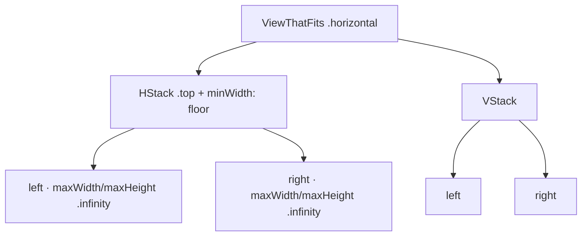

# ResponsiveRow

**File:** [`apps/native/WolfWave/Views/Shared/ResponsiveRow.swift`](../../apps/native/WolfWave/Views/Shared/ResponsiveRow.swift)

## Purpose
Lays two views side by side, collapsing to a vertical stack when the container is narrower than a floor width. Used by the History & Stats dashboard to pair cards (summary + today's top track, the two charts, retention + actions) into two columns on a wide settings window and a single column on a narrow one.

## API
```swift
ResponsiveRow {
    summaryCard
} right: {
    todaysTopTrackCard
}
```

| Param | Type | Notes |
|---|---|---|
| `floor` | `CGFloat` | Minimum container width that justifies two columns. Defaults to `DSDimension.HistoryStats.twoColumnFloor` (624). |
| `spacing` | `CGFloat` | Column gap (wide) / stack gap (narrow). Defaults to `AppConstants.SettingsUI.sectionSpacing` (24). |
| `left` | `@ViewBuilder () -> Left` | Leading view (first column / top of stack). |
| `right` | `@ViewBuilder () -> Right` | Trailing view (second column / bottom of stack). |

## How it works
`ViewThatFits(in: .horizontal)` offers a two-column `HStack` candidate first and a `VStack` fallback. The `HStack` candidate carries `.frame(minWidth: floor)`, so `ViewThatFits` only selects it when the pane is at least `floor` wide. Without that floor, flexible `maxWidth: .infinity` children report as "fitting" at any width and the layout would never collapse. In the wide layout both children also take `maxHeight: .infinity`, so paired cards stretch to equal height and read as one band.

## Tokens used
- `DSDimension.HistoryStats.twoColumnFloor` (624) — default collapse threshold
- `AppConstants.SettingsUI.sectionSpacing` (24) — default gap

## Anatomy


## Accessibility
- Purely structural; adds no semantics of its own. The two children keep their own accessibility elements and reading order (left/top before right/bottom in both layouts).
- Collapsing to one column improves readability at large Dynamic Type sizes and narrow windows.

## Do / Don't
- ✅ Use for two peer cards that benefit from sitting side by side but must stack when space is tight.
- ✅ Let the children own their card surface (`cardStyleUnpadded()`); `ResponsiveRow` only handles placement.
- ❌ Don't put a card that grows/expands on interaction (e.g. the `!stats` card) inside it — the row will jiggle on toggle. Keep those full width.
- ❌ Don't nest more than two columns; for a true grid of many tiles use `LazyVGrid`.

## Example
```swift
ResponsiveRow {
    WeekChartCard(snapshot: snapshot)
} right: {
    HourChartCard(snapshot: snapshot)
}
```
