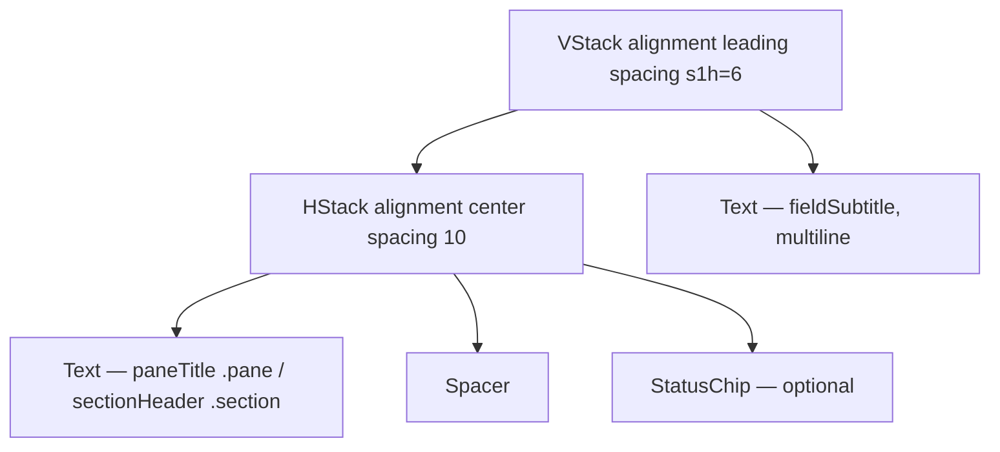

# SectionHeaderWithStatus

**File:** [`apps/native/WolfWave/Views/Shared/SectionHeaderWithStatus.swift`](../../apps/native/WolfWave/Views/Shared/SectionHeaderWithStatus.swift)

## Purpose
Section header (title + subtitle) with an optional inline `StatusChip` on the trailing edge. The connective tissue between every settings pane (Discord, Twitch, WebSocket). Renders at one of two heading levels via `prominence`.

## API
```swift
SectionHeaderWithStatus(
    title: "Discord",
    subtitle: "Show your music on your Discord profile.",
    prominence: .pane,        // default — H1 pane title (22 bold)
    statusText: "Connected",
    statusColor: .green
)
```

| Param | Type | Notes |
|---|---|---|
| `title` | `String` | Short noun-phrase. Rendered via `.paneTitle()` (22 bold) when `prominence == .pane`, `.sectionHeader()` (17 semibold) when `.section`. |
| `subtitle` | `String` | One-sentence purpose. Rendered via `.fieldSubtitle()` (13 secondary). Wraps vertically. |
| `prominence` | `Prominence` | `.pane` (default) for the H1 at the top of a pane; `.section` for an H2 sub-section inside a pane (e.g. Discord "Preview"). Keeps a clear 22 → 17 step instead of two near-identical headings. |
| `statusText` | `String?` | Drives the trailing chip. Nil → no chip rendered. |
| `statusColor` | `Color?` | Required when `statusText` is non-nil. Use semantic tokens. |

## Tokens used
- `.paneTitle()` (22 bold) / `.sectionHeader()` (17 semibold) view modifiers (defined in `ViewModifiers.swift`) — title typography by `prominence`. Both carry the `.isHeader` accessibility trait.
- `.fieldSubtitle()` (`DSFont.Size.base` 13, `.secondary`) — subtitle
- `DSSpace.s1h` (6) — title ↔ subtitle vertical spacing
- `DSSpace.s3` (10) — title ↔ chip horizontal spacing
- Composes `StatusChip` — see [status-chip.md](status-chip.md)

## Anatomy


## Accessibility
- `accessibilityElement(children: .combine)` so VoiceOver speaks the header as a single unit. The title modifier's `.isHeader` trait merges into the combined element, so the VoiceOver heading rotor lands on every pane/section title.
- Chip's own label is overridden to `"<title> status: <statusText>"` so context is preserved.
- Chip animates with `.easeInOut(duration: 0.2)` on `statusText` change — avoid rapid status thrash.

## Do / Don't
- ✅ One `.pane` header per pane, at the very top; use `.section` for sub-sections within that pane.
- ✅ Pass nil `statusText` for sections without a connection (General, Music Monitor).
- ❌ Don't put a `StatusChip` standalone next to a header — use this component so the layout stays consistent.
- ❌ Don't put body content inside the header — render it separately below.
- ❌ **No leading SF Symbol icon on a pane or section header.** Headers (`.paneTitle()` / `.sectionHeader()`) stay text-only — that is the macOS Settings convention (icons live in the sidebar, not on inline headers) and keeps the panes flat and consistent. Six former sub-headers (Integrations, Bot Commands, Widget Setup, Widget Appearance, Chat Vote-Skip, Song Request Commands) once carried a blue `.controlAccentColor` glyph; they were removed 2026-06-04. The gray card-eyebrow (`CardEyebrowHeader`, History & Stats) and the red Danger Zone warning are a separate, semantic tier and may keep their icon.

> **Type ramp note.** The retired `.sectionSubHeader()` (15pt, only 2pt under the old 17pt pane title) was removed 2026-06-05. The ramp is now `.paneTitle()` 22 → `.sectionHeader()` 17 → `.sectionEyebrow()` 11, with perceptible steps per NN/g visual-hierarchy guidance. Former `.sectionSubHeader()` call sites are now `.sectionHeader()` (section titles) or `.sectionEyebrow()` (small card labels).

## Example
```swift
SectionHeaderWithStatus(
    title: "Twitch Chat",
    subtitle: "Connect once. !song works for your viewers.",
    statusText: viewModel.isConnected ? "Connected" : nil,
    statusColor: viewModel.isConnected ? DSColor.success : nil
)
```
