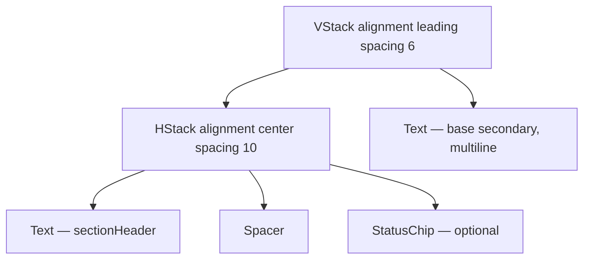

# SectionHeaderWithStatus

**File:** [`apps/native/WolfWave/Views/Shared/SectionHeaderWithStatus.swift`](../../apps/native/WolfWave/Views/Shared/SectionHeaderWithStatus.swift)

## Purpose
Top-level section header (title + subtitle) with an optional inline `StatusChip` on the trailing edge. The connective tissue between every settings pane (Discord, Twitch, WebSocket).

## API
```swift
SectionHeaderWithStatus(
    title: "Discord Status",
    subtitle: "Show your music on your Discord profile.",
    statusText: "Connected",
    statusColor: .green
)
```

| Param | Type | Notes |
|---|---|---|
| `title` | `String` | Uses the `.sectionHeader()` modifier. Short noun-phrase. |
| `subtitle` | `String` | One-sentence purpose. Wraps vertically. |
| `statusText` | `String?` | Drives the trailing chip. Nil → no chip rendered. |
| `statusColor` | `Color?` | Required when `statusText` is non-nil. Use semantic tokens. |

## Tokens used
- `.sectionHeader()` view modifier (defined in `ViewModifiers.swift`) — title typography
- `DSFont.Size.base` (13) `.secondary` — subtitle
- `DSSpace.s2`-ish (6) — title ↔ subtitle vertical spacing
- `DSSpace.s3` (10) — title ↔ chip horizontal spacing
- Composes `StatusChip` — see [status-chip.md](status-chip.md)

## Anatomy


## Accessibility
- `accessibilityElement(children: .combine)` so VoiceOver speaks the header as a single unit.
- Chip's own label is overridden to `"<title> status: <statusText>"` so context is preserved.
- Chip animates with `.easeInOut(duration: 0.2)` on `statusText` change — avoid rapid status thrash.

## Do / Don't
- ✅ One header per settings section, at the top of the pane.
- ✅ Pass nil `statusText` for sections without a connection (General, Music Monitor).
- ❌ Don't put a `StatusChip` standalone next to a header — use this component so the layout stays consistent.
- ❌ Don't put body content inside the header — render it separately below.

## Example
```swift
SectionHeaderWithStatus(
    title: "Twitch Chat",
    subtitle: "Connect once. !song works for your viewers.",
    statusText: viewModel.isConnected ? "Connected" : nil,
    statusColor: viewModel.isConnected ? DSColor.success : nil
)
```
