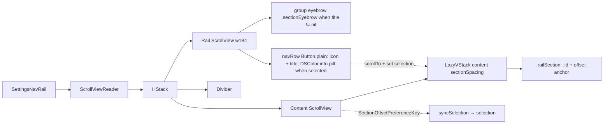

# SettingsNavRail

**File:** [`apps/native/WolfWave/Views/Shared/SettingsNavRail.swift`](../../apps/native/WolfWave/Views/Shared/SettingsNavRail.swift)

## Purpose
Two-column settings layout shared by long detail panes: a fixed jump-nav rail on
the left and one always-mounted, scrollable content column on the right. Tapping a
rail row scrolls its section to the top; scrolling manually moves the highlight to
whatever section you land on. Replaces in-pane segmented tabs (which swapped
content) so a pane reads as one scroll with focused groups. Used by General, Debug,
and Song Requests.

## API
```swift
SettingsNavRail(
    selection: $selected,                                   // Binding<Section>
    groups: [SettingsRailGroup(sections: MySection.allCases)],
    accessibilityIDPrefix: "myNav"                          // → "myNav.<rawValue>"
) {
    Header().railSection(MySection.first)                   // anchor rides the header
    FirstCard()
    SecondCard().railSection(MySection.second)
    // …
}
```

`Section` conforms to **`SettingsRailSection`** (`Hashable, RawRepresentable where
RawValue == String`) supplying `title` (row label) + `icon` (SF Symbol). Tag the
top view of each section with `.railSection(_:)`; **pass the explicit enum case**
(`MySection.second`, not `.second`) — the modifier is generic and can't infer the
type from a leading-dot member. Grouped rails pass several `SettingsRailGroup`s with
titles (e.g. Debug's "State & Diagnostics" / "Active Controls"); flat rails pass one
group with a `nil` title.

| Param | Type | Notes |
|---|---|---|
| `selection` | `Binding<Section>` | Highlighted row + scroll target. |
| `groups` | `[SettingsRailGroup<Section>]` | Ordered rail clusters; `nil` title = no eyebrow. |
| `accessibilityIDPrefix` | `String` | Seeds each row id: `"<prefix>.<section.rawValue>"`. |
| `content` | `() -> Content` | `@ViewBuilder`; stacked sections, each top view tagged `.railSection(_:)`. |

## Tokens used
- `DSColor.info` — selected row text + 14%-opacity highlight fill
- `DSRadius.sm` (6) — highlight pill corner
- `DSFont.Size.body` (12) — row label (`.semibold` when selected)
- `DSSpace.s1`/`s2`/`s3`/`s4`/`s6` — rail row + container padding, icon frame
- `DSMotion.Duration.base` (0.22) — tap scroll animation
- `AppConstants.SettingsUI.{maxContentWidth, contentPaddingH, contentPaddingV, sectionSpacing}` — content column geometry
- rail width: `184` (fixed)

## Anatomy


## Accessibility
- Each rail row is a `Button` with `.help("Jump to <title>")` and
  `.accessibilityIdentifier("<prefix>.<rawValue>")` for UI tests.
- `.pointerCursor()` — flips to the pointing-hand cursor on hover.
- Selection follows both taps and manual scrolling, so the highlighted row always
  reflects the visible section.
- The content column clamps to `AppConstants.SettingsUI.maxContentWidth` for
  readable line lengths regardless of window size.

## Do / Don't
- ✅ Use for long settings panes that bypass the shell's `standardDetailScroll` and
  own the full detail width (wire the bypass in `SettingsView.detailPane`).
- ✅ Tag exactly one view per section with `.railSection(_:)` — the one that should
  sit at the top when its row is tapped (usually the section's first card or the
  page header for the top section).
- ✅ Pass the explicit enum case to `.railSection(MySection.case)`.
- ❌ Don't wrap the whole component in another `ScrollView` — it owns its scroll;
  double-wrapping breaks the rail's full-height layout.
- ❌ Don't tag a transparent `Group` with `.railSection` — `.id` on a Group doesn't
  give `ScrollViewReader` a single target. Tag a concrete view.

## Example
```swift
private enum DebugSection: String, SettingsRailSection {
    case inspectors, metrics, logs
    var title: String { /* … */ }
    var icon: String { /* … */ }
}

SettingsNavRail(
    selection: $selected,
    groups: [SettingsRailGroup(title: "State & Diagnostics",
                               sections: [.inspectors, .metrics, .logs])],
    accessibilityIDPrefix: "debugNav"
) {
    DebugInspectorsCard().railSection(DebugSection.inspectors)
    DebugMetricsCard().railSection(DebugSection.metrics)
    DebugLogsAndEventsCard().railSection(DebugSection.logs)
}
```
