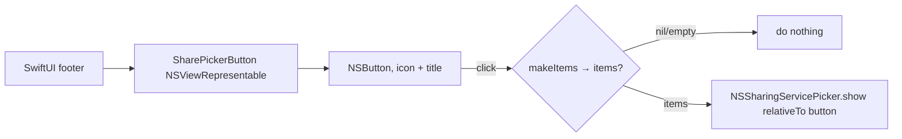

# SharePickerButton

**File:** [`apps/native/WolfWave/Views/Shared/SharePickerButton.swift`](../../apps/native/WolfWave/Views/Shared/SharePickerButton.swift)

## Purpose
Presents the native macOS share sheet (`NSSharingServicePicker`: Messages, Mail, AirDrop, Notes, etc.). Wraps an `NSButton` because the picker must anchor to a real `NSView`, which a SwiftUI `Button` can't hand back.

## API
```swift
SharePickerButton(makeItems: { [fileURL] })
```

| Param | Type | Notes |
|---|---|---|
| `title` | `String` | Visible label. Default `"Share"`. |
| `systemImage` | `String` | SF Symbol leading the title. Default `"square.and.arrow.up"`. |
| `isProminent` | `Bool` | Fills the bezel with `controlAccentColor` and whitens label + glyph so it sits beside a SwiftUI `.borderedProminent` button. Default `false`. |
| `makeItems` | `() -> [Any]?` | Builds the share items on click (main thread). Return `nil`/empty to suppress the picker (e.g. a render failed). Typically returns a temp file `URL`. |

## Tokens used
- None directly; renders as a system `NSButton` (`.rounded` bezel) so it matches native control metrics next to SwiftUI `.bordered` buttons.
- Wrap with `.fixedSize()` in SwiftUI so the representable doesn't stretch.

## Anatomy


## Accessibility
- The `NSButton` carries the SF Symbol's `accessibilityDescription` (set to `title`).
- Anchor host should add an `.accessibilityLabel` describing the target ("Share monthly wrap").
- Picker is keyboard + VoiceOver navigable. It's the standard system sheet.

## Do / Don't
- ✅ Return a temp file `URL` from `makeItems` for image/file shares. Most services prefer a file over raw `NSImage`.
- ✅ Gate visibility on "is there anything to share" at the call site (e.g. `if wrap.hasData`).
- ✅ Wrap with `.fixedSize()` so it sizes to its content.
- ❌ Don't try to present `NSSharingServicePicker` from a SwiftUI `Button`; it has no `NSView` to anchor to.
- ❌ Don't do heavy rendering off the main thread inside `makeItems`; it runs on the main thread on click.
- ❌ Don't rely on `contentTintColor` to whiten the glyph in `isProminent` mode. A rounded bezel with an explicit `bezelColor` ignores it for the image, leaving the glyph in `labelColor` (dark on the accent fill, flipping per appearance). The color is baked into the symbol via `SymbolConfiguration(paletteColors:)` instead.

## Example
```swift
if wrap.hasData {
    SharePickerButton(makeItems: shareItems)
        .fixedSize()
        .accessibilityLabel("Share monthly wrap")
}

// shareItems() renders the card to a temp PNG and returns [url].
```
