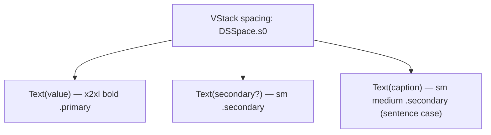

# StatTile

A vertical stat tile: large primary value, optional secondary value, sentence-case caption beneath.

## Purpose

Replaces the ad-hoc `summaryStat(value:unit:label:)` helper that stacked a number, a unit, and an ALL-CAPS label. Used in the History & Stats summary row ("129 / 27m / This week"). Combines the three text rows into a single accessibility element so VoiceOver reads "This week: 129, 27 minutes" as one stat.

## API

```swift
StatTile(
    value: String,
    secondary: String? = nil,
    caption: String,
    accessibilityIdentifier: String? = nil
)
```

## Tokens used

| Token | Where |
|---|---|
| `DSSpace.s0` | VStack inner spacing |
| `DSFont.Size.x2xl` (22) | primary value |
| `DSFont.Size.sm` (11) | secondary + caption |

## Anatomy



## Accessibility

- Combined accessibility element via `.accessibilityElement(children: .combine)`.
- Label format: `"\(caption): \(value), \(secondary)"`.
- Identifier defaults to `"statTile.\(caption)"`.
- `value` is `.monospacedDigit()` for stable width when count animates.

## Do / Don't

- ✅ Use sentence-case captions ("This week", "Top hour", "All time").
- ✅ Pair three tiles with `Divider().frame(height: 40)` between them inside a `.cardStyleUnpadded()` row.
- ❌ Don't pass ALL-CAPS captions — the component renders sentence case deliberately.
- ❌ Don't wrap each tile in its own card — they're row segments.

## Example

```swift
HStack(spacing: 0) {
    StatTile(value: "\(snapshot.playsThisWeek)",
             secondary: HistoryFormat.listeningTime(snapshot.listeningSecondsThisWeek),
             caption: "This week")
    Divider().frame(height: 40)
    StatTile(value: "\(snapshot.playsToday)",
             secondary: HistoryFormat.listeningTime(snapshot.listeningSecondsToday),
             caption: "Today")
    Divider().frame(height: 40)
    StatTile(value: "\(snapshot.totalPlays)",
             secondary: HistoryFormat.listeningTime(snapshot.totalListeningSeconds),
             caption: "All time")
}
.padding(AppConstants.SettingsUI.cardPadding)
.cardStyleUnpadded()
```
