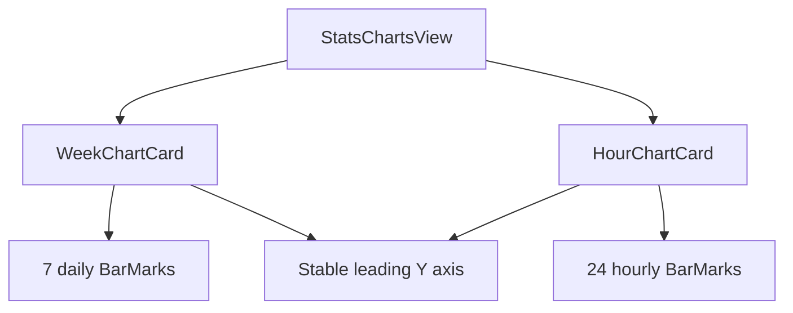

# StatsChartsView

**File:** [`apps/native/WolfWave/Views/HistoryStats/StatsChartsView.swift`](../../apps/native/WolfWave/Views/HistoryStats/StatsChartsView.swift)

## Purpose

Provides the History & Stats chart surfaces: a seven-day play-count card, a listening-by-hour card, and a combined vertical wrapper retained for previews and single-column callers.

## API

```swift
WeekChartCard(snapshot: StatsSnapshot)
HourChartCard(snapshot: StatsSnapshot)
StatsChartsView(snapshot: StatsSnapshot)
```

| Param | Type | Notes |
|---|---|---|
| `snapshot` | `StatsSnapshot` | Supplies the seven daily counts and 24 hourly buckets. Unexpected short hourly arrays safely read as zero. |

## Tokens used

- `DSSpace.s3` separates each card heading from its chart.
- `DSDimension.HistoryStats.chartHeight` fixes both plots to the same height.
- `DSDimension.HistoryStats.chartYAxisGutter` keeps the leading Y axis stable as counts gain digits.
- The week chart uses the Apple Music brand gradient; the hour chart follows the system accent color.

## Anatomy



## Accessibility

- Each chart has a concise overall accessibility label.
- Every bar supplies a spoken day or hour and a pluralized play-count value.
- Hour labels say “Midnight” and “Noon” instead of exposing compact visual axis text.
- The fixed, monospaced Y-axis gutter prevents visual reflow as live counts change.

## Do / Don't

- ✅ Pair `WeekChartCard` and `HourChartCard` in `ResponsiveRow` for the settings dashboard.
- ✅ Pass `.empty` while no data exists; both charts remain safe to render.
- ❌ Don't index `playsByHour` directly without the bounds-safe helper.
- ❌ Don't replace the fixed Y-axis gutter with the default leading axis; growing labels visibly resize the bars.

## Example

```swift
ResponsiveRow {
    WeekChartCard(snapshot: snapshot)
} right: {
    HourChartCard(snapshot: snapshot)
}
```
