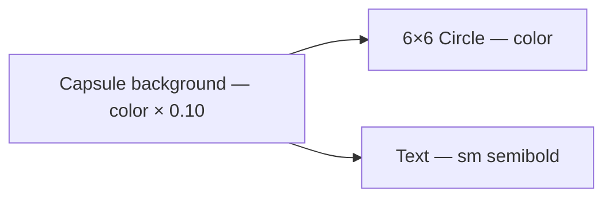

# StatusChip

**File:** [`apps/native/wolfwave/Views/Shared/StatusChip.swift`](../../apps/native/wolfwave/Views/Shared/StatusChip.swift)

## Purpose
Capsule-shaped status indicator (colored dot + label) used in settings sections to show connection or server state.

## API
```swift
StatusChip(text: "Connected", color: .green)
```

| Param | Type | Notes |
|---|---|---|
| `text` | `String` | Short status label (≤ 16 chars). |
| `color` | `Color` | Tint for the dot + 10% background fill. Use semantic tokens. |

## Tokens used
- `DSFont.Size.sm` (11) / `DSFont.Weight.semibold`
- `DSSpace.s3` (10) horizontal padding, `DSSpace.s2`-ish (5) vertical
- `DSRadius.pill` (clipped to `Capsule`)
- Color: caller passes `DSColor.success` / `.warning` / `.error` / `.info` typically

## Anatomy


## Accessibility
- Combined element; VoiceOver reads the label.
- Fixed `minWidth: 130` keeps layout stable between state changes — animation of width doesn't fight with text update.
- Color is **decorative**, not the sole signal — the text always conveys status.

## Do / Don't
- ✅ Use one chip per status concern (e.g. one for Twitch connection, one for WebSocket).
- ✅ Pair with `DSColor.success / warning / error / info`.
- ❌ Don't put it inline with body copy — it's a section-level indicator.
- ❌ Don't pass long strings; truncate or use a different component.

## Example
```swift
StatusChip(text: "Connected", color: DSColor.success)
```
