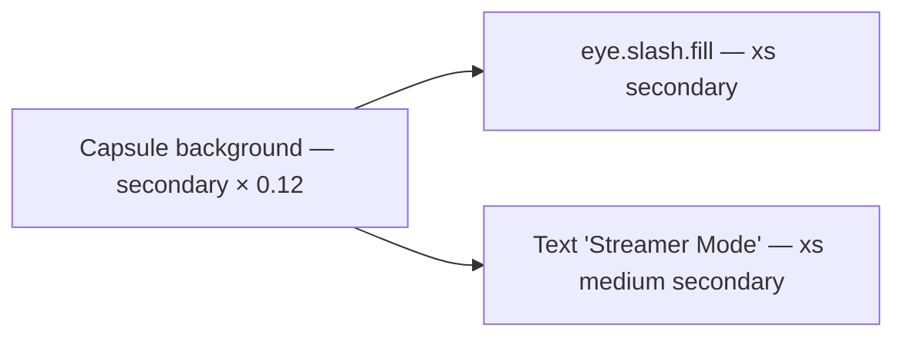

# StreamerModeBadge

**File:** [`apps/native/WolfWave/Views/Shared/StreamerModeBadge.swift`](../../apps/native/WolfWave/Views/Shared/StreamerModeBadge.swift)

## Purpose
Inline pill that announces a row's value or control is hidden/locked because **Streamer Mode** is on. Pair it with values masked by [`StreamerMode.mask`](../../apps/native/WolfWave/Core/StreamerMode.swift) (or with `.disabled(streamerMode)` buttons) so viewers and the streamer immediately know the empty/locked state is intentional, not a bug.

## API
```swift
if streamerMode { StreamerModeBadge() }
```

No parameters. Caller owns the streamer-mode read (typically `@AppStorage(AppConstants.UserDefaults.streamerModeEnabled)`) and the `if` guard — the badge does not read UserDefaults itself, keeping it preview-safe and side-effect free.

## Tokens used
- `DSFont.Size.xs` (10) — both glyph and label
- `DSSpace.s1` (4) — glyph-to-label spacing
- `DSSpace.s2` (8) horizontal padding, `DSSpace.s0` (2) vertical
- Foreground: `.secondary` (system role color)
- Background: `Color.secondary.opacity(0.12)` clipped to `Capsule()`
- SF Symbol: `eye.slash.fill`

## Anatomy


## Accessibility
- Combined element; VoiceOver reads **"Streamer Mode is on"** via `accessibilityLabel`.
- `accessibilityIdentifier: "streamerModeBadge"` for UI tests.
- Decorative use is **not allowed** — the badge is the *only* affordance explaining why a neighboring value is masked, so it must remain in the a11y tree.

## Do / Don't
- ✅ Place next to or below the section title of a masked row (`Local Address`, `Auth Token`, `BROWSER SOURCE URL`, …).
- ✅ Render only when streamer mode is on — calling site guards with `if streamerMode { … }`.
- ❌ Don't stack multiple badges in one card — one badge per masked region is enough.
- ❌ Don't replace the masked text with the badge — keep both (text reads "hidden — streamer mode", badge explains *why*).
- ❌ Don't add it next to values that are not actually masked or controls that are not actually disabled — that's misleading.

## Example
```swift
HStack(spacing: DSSpace.s2) {
    Text("Local Address")
        .font(.system(size: DSFont.Size.sm, weight: .medium))
        .foregroundStyle(.secondary)
    if streamerMode { StreamerModeBadge() }
}
Text(StreamerMode.mask(connectionURL, style: .url, isOn: streamerMode))
    .font(.system(size: DSFont.Size.body, design: .monospaced))
```
