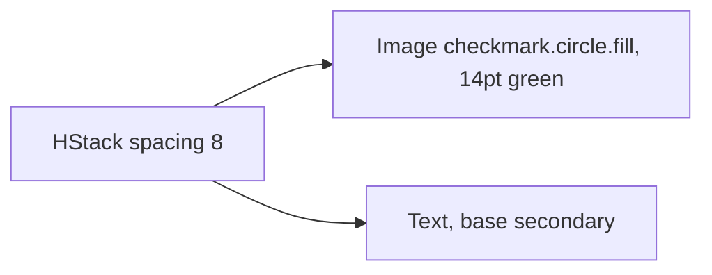

# SuccessFeedbackRow

**File:** [`apps/native/WolfWave/Views/Shared/SuccessFeedbackRow.swift`](../../apps/native/WolfWave/Views/Shared/SuccessFeedbackRow.swift)

## Purpose
Inline green checkmark + confirmation label: the "you did the thing" reassurance after a successful action.

## API
```swift
SuccessFeedbackRow(text: "Discord Status enabled!")
```

| Param | Type | Notes |
|---|---|---|
| `text` | `String` | Past-tense, exclamation OK ("Saved!", "Connected!"). |
| `fontWeight` | `Font.Weight` | Default `.regular`. Bump to `.medium` for hero confirmations (onboarding final step). |

## Tokens used
- `DSColor.success` (`#34C759`): checkmark glyph (`.green` shorthand)
- `DSFont.Size.base` (13): label
- `DSSpace.s2` (8): icon ↔ label gap
- `.secondary` foreground style: label muted so the green dominates

## Anatomy


## Motion

- `.symbolEffect(.bounce, value: text)` on the `checkmark.circle.fill` glyph: a bounce fires whenever the row appears or the success text changes, giving a satisfying "done" cue.
- `.contentTransition(.opacity)` on the label: text changes cross-fade.
- For first-paint, callers should still wrap the row in `.transition(.opacity)` at the parent. The row itself doesn't animate insertion.

## Accessibility
- Reads naturally as "checkmark, <text>" via VoiceOver; no extra label needed.
- Colour is decorative; the checkmark glyph + text both convey success.
- The `symbolEffect` respects system Reduce Motion automatically (SF Symbol effects degrade to no-op under the system setting).

## Do / Don't
- ✅ Use after the action settles (toggle flipped, OAuth completed, copy succeeded).
- ✅ Keep the text positive and past-tense.
- ❌ Don't use for in-progress states. Use `ProgressView` instead.
- ❌ Don't reuse for errors; there's no "FailureFeedbackRow" because failures need actionable copy.

## Example
```swift
if discordEnabled {
    SuccessFeedbackRow(text: "Discord status enabled!")
        .transition(.opacity)
}
```
