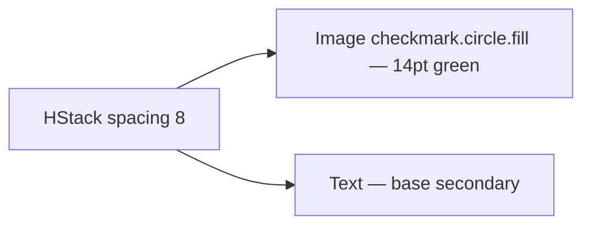

# SuccessFeedbackRow

**File:** [`apps/native/wolfwave/Views/Shared/SuccessFeedbackRow.swift`](../../apps/native/wolfwave/Views/Shared/SuccessFeedbackRow.swift)

## Purpose
Inline green checkmark + confirmation label — the "you did the thing" reassurance after a successful action.

## API
```swift
SuccessFeedbackRow(text: "Discord Status enabled!")
```

| Param | Type | Notes |
|---|---|---|
| `text` | `String` | Past-tense, exclamation OK ("Saved!", "Connected!"). |
| `fontWeight` | `Font.Weight` | Default `.regular`. Bump to `.medium` for hero confirmations (onboarding final step). |

## Tokens used
- `DSColor.success` (`#34C759`) — checkmark glyph (`.green` shorthand)
- `DSFont.Size.base` (13) — label
- `DSSpace.s2` (8) — icon ↔ label gap
- `.secondary` foreground style — label muted so the green dominates

## Anatomy


## Accessibility
- Reads naturally as "checkmark, <text>" via VoiceOver — no extra label needed.
- Colour is decorative; the checkmark glyph + text both convey success.
- No animation — pair with `.transition(.opacity)` at the call site if it appears asynchronously.

## Do / Don't
- ✅ Use after the action settles (toggle flipped, OAuth completed, copy succeeded).
- ✅ Keep the text positive and past-tense.
- ❌ Don't use for in-progress states — use `ProgressView` or `ConnectionTestButton` instead.
- ❌ Don't reuse for errors — there's no "FailureFeedbackRow" because failures need actionable copy.

## Example
```swift
if discordEnabled {
    SuccessFeedbackRow(text: "Discord status enabled!")
        .transition(.opacity)
}
```
