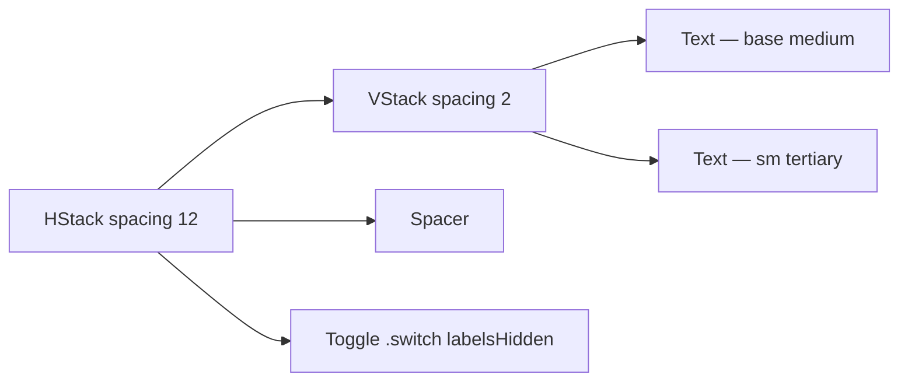

# ToggleSettingRow

**File:** [`apps/native/WolfWave/Views/Shared/ToggleSettingRow.swift`](../../apps/native/WolfWave/Views/Shared/ToggleSettingRow.swift)

## Purpose
Title + subtitle + native macOS switch in a single horizontal row, used everywhere a setting is "off/on" with explanatory text.

## API
```swift
ToggleSettingRow(
    title: "Enable Feature",
    subtitle: "A short description of what this does",
    isOn: $isOn,
    accessibilityLabel: "Enable Feature",
    accessibilityIdentifier: "featureToggle"
)
```

| Param | Type | Notes |
|---|---|---|
| `title` | `String` | Bold, 13pt medium. Action verb preferred ("Enable …", "Show …"). |
| `subtitle` | `String` | 11pt tertiary. One-line explanation of the effect. |
| `isOn` | `Binding<Bool>` | Two-way state binding. |
| `controlSize` | `ControlSize` | Default `.small`. Use `.regular` only for high-emphasis toggles. |
| `isDisabled` | `Bool` | Greys out and locks the toggle; row dims to 50% opacity. |
| `accessibilityLabel` | `String` | Required — VoiceOver reads this in lieu of the visual label. |
| `accessibilityIdentifier` | `String` | Required — for UI tests. |
| `accessibilityHint` | `String?` | Optional — explains the consequence ("Reconnects Twitch chat."). |
| `onChange` | `((Bool) -> Void)?` | Side-effect on toggle (e.g. start/stop a service). Binding still updates. |

## Tokens used
- `DSFont.Size.base` (13) / `DSFont.Weight.medium` — title
- `DSFont.Size.sm` (11) — subtitle (`.tertiary` foreground)
- `DSSpace.s4` (12) — `HStack` horizontal spacing
- Standard macOS `.switch` toggle style — no custom color

## Anatomy


## Accessibility
- VoiceOver reads `accessibilityLabel` + `accessibilityValue` ("Enabled" / "Disabled").
- `accessibilityHint` describes the consequence of flipping — set it when the effect is non-obvious.
- Row honours `@Environment(\.isEnabled)` — wrap in `.disabled(...)` to fade the whole group, not just the switch.

## Do / Don't
- ✅ Wrap in `.cardStyle()` so multiple rows stack inside a card with proper padding.
- ✅ Use `onChange` for service start/stop side-effects; keep the binding pure UI state.
- ❌ Don't put two toggles in one row — split into two `ToggleSettingRow`s.
- ❌ Don't pass subtitle text longer than ~80 chars — it wraps and breaks alignment with the switch.

## Example
```swift
ToggleSettingRow(
    title: "Discord Rich Presence",
    subtitle: "Show \"Listening to Apple Music\" on your Discord profile.",
    isOn: $discordEnabled,
    accessibilityLabel: "Discord Rich Presence",
    accessibilityIdentifier: "discord.toggle",
    onChange: { enabled in discordService.setEnabled(enabled) }
)
.cardStyle()
```
